# Diagrammes de Flux - Application et Base de Données

## Vue d'ensemble

Ce document présente les diagrammes de flux de l'application **Agent Éditorial & Concurrentiel** et de sa base de données PostgreSQL.

---

## 1. Diagramme de Flux de l'Application

### 1.1 Architecture Générale

```mermaid
flowchart TB
    Client[👤 Client/Application<br/>📱 Frontend/API Client]
    API[🚀 FastAPI API<br/>🌐 Port 8000<br/>📡 REST + WebSocket]
    
    subgraph Routes["📋 Routes API"]
        direction TB
        Health[💚 Health Check<br/>/health]
        Sites[🏢 Sites<br/>/sites/analyze]
        Competitors[🔍 Competitors<br/>/competitors/search]
        Discovery[🔎 Discovery<br/>/discovery/scrape]
        Trend[📈 Trend Pipeline<br/>/trend-pipeline/analyze]
        Executions[⚙️ Executions<br/>/executions/{id}]
        Errors[❌ Errors<br/>/errors]
        Articles[📝 Articles<br/>/articles/enrich]
    end
    
    subgraph Agents["🤖 Agents Multi-LLM"]
        direction TB
        Editorial[📊 Editorial Analysis<br/>Agent]
        Competitor[🎯 Competitor Search<br/>Agent]
        Scraping[🕷️ Enhanced Scraping<br/>Agent]
        TrendPipeline[📈 Trend Pipeline<br/>Agent]
    end
    
    subgraph Services["🌍 Services Externes"]
        direction TB
        LLM[🧠 LLM Models<br/>Llama3 🤖<br/>Mistral 🌊<br/>Phi3 ⚡]
        Qdrant[🔍 Qdrant Vector DB<br/>📊 Embeddings]
        Tavily[🔎 Tavily Search API<br/>🌐 Web Search]
        DuckDuckGo[🦆 DuckDuckGo API<br/>🔍 Search]
    end
    
    subgraph Database["💾 PostgreSQL Database"]
        direction TB
        Tables[(🗄️ Tables de données<br/>📊 20+ tables)]
    end
    
    Client -->|HTTP/WebSocket| API
    API -->|Route| Routes
    Routes -->|Execute| Agents
    Agents -->|Query| LLM
    Agents -->|Store/Query| Qdrant
    Agents -->|Search| Tavily
    Agents -->|Search| DuckDuckGo
    Agents -->|CRUD| Database
    Database -->|Persist| Tables
    
    style Client fill:#4a90e2,stroke:#2c5aa0,stroke-width:3px,color:#fff
    style API fill:#50c878,stroke:#2d7a4e,stroke-width:3px,color:#fff
    style Routes fill:#e3f2fd,stroke:#1976d2,stroke-width:2px
    style Agents fill:#fff3e0,stroke:#f57c00,stroke-width:2px
    style Services fill:#f3e5f5,stroke:#7b1fa2,stroke-width:2px
    style Database fill:#9370db,stroke:#5e4a9e,stroke-width:3px,color:#fff
    style LLM fill:#ff6b6b,stroke:#c92a2a,stroke-width:2px,color:#fff
    style Qdrant fill:#ffa500,stroke:#cc8500,stroke-width:2px,color:#fff
```

### 1.2 Flux Fonctionnel Principal

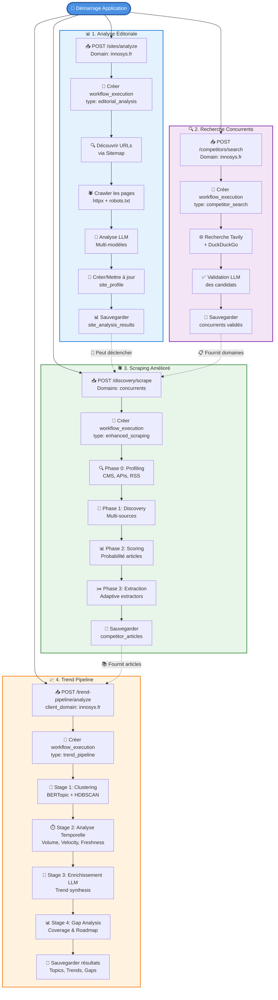

### 1.3 Flux Détaillé - Analyse Éditoriale

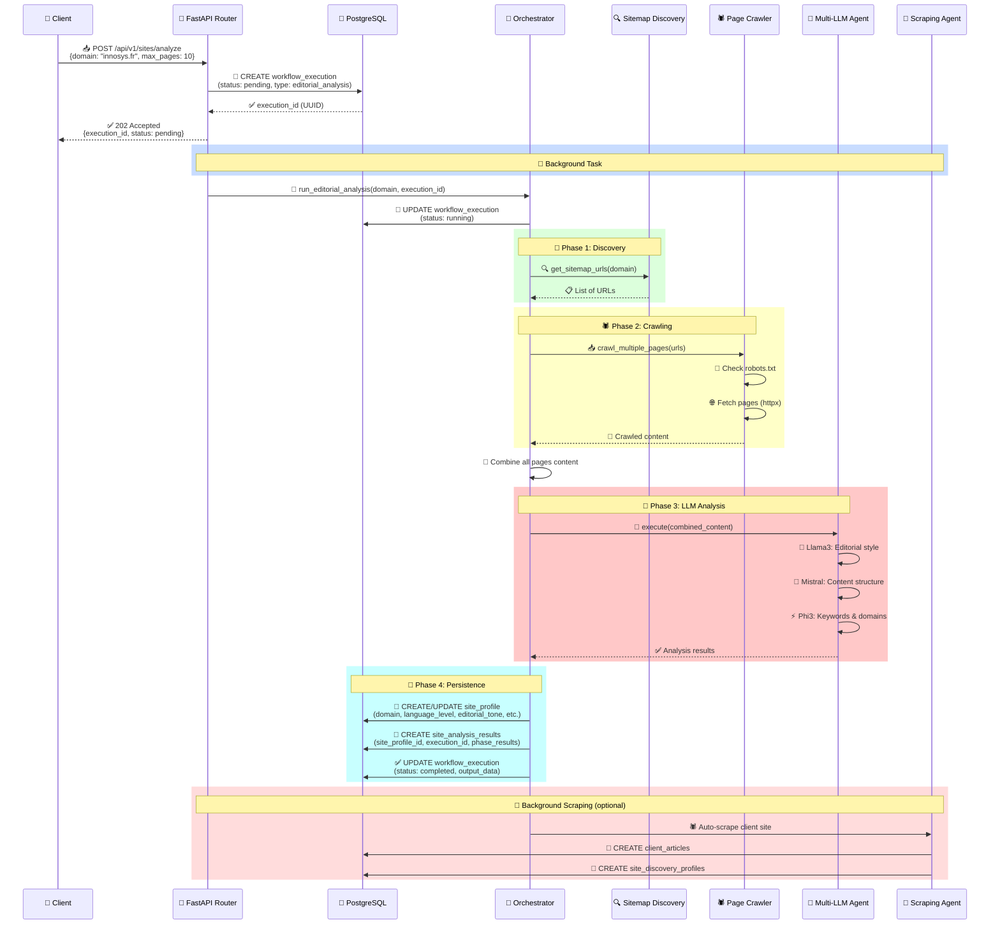

### 1.4 Flux Détaillé - Trend Pipeline

```mermaid
flowchart TD
    Start([📥 POST /trend-pipeline/analyze<br/>client_domain: innosys.fr])
    
    CreateExec[📝 Créer workflow_execution<br/>type: trend_pipeline<br/>status: running]
    
    subgraph Stage1["🎯 Stage 1: Clustering"]
        direction TB
        S1A[📚 Récupérer articles<br/>concurrents]
        S1B[🔢 Générer embeddings<br/>Vector DB]
        S1C[🎯 BERTopic clustering<br/>Topic discovery]
        S1D[📊 HDBSCAN outliers<br/>Outlier detection]
        S1E[💾 Sauvegarder<br/>topic_clusters]
        S1F[💾 Sauvegarder<br/>topic_outliers]
    end
    
    subgraph Stage2["⏱️ Stage 2: Temporal Analysis"]
        direction TB
        S2A[📈 Calculer métriques<br/>temporelles]
        S2B[📊 Volume, Velocity<br/>Freshness]
        S2C[💾 Sauvegarder<br/>topic_temporal_metrics]
    end
    
    subgraph Stage3["🧠 Stage 3: LLM Enrichment"]
        direction TB
        S3A[✨ Enrichir chaque topic<br/>avec LLM]
        S3B[📝 Générer recommandations<br/>d'articles]
        S3C[💾 Sauvegarder<br/>trend_analysis]
        S3D[💾 Sauvegarder<br/>article_recommendations]
        S3E[💾 Sauvegarder<br/>weak_signals_analysis]
    end
    
    subgraph Stage4["📊 Stage 4: Gap Analysis"]
        direction TB
        S4A[🔍 Analyser couverture<br/>client]
        S4B[💪 Identifier forces<br/>client]
        S4C[⚠️ Identifier gaps<br/>éditoriaux]
        S4D[🗺️ Générer roadmap<br/>contenu]
        S4E[💾 Sauvegarder<br/>client_coverage_analysis]
        S4F[💾 Sauvegarder<br/>client_strengths]
        S4G[💾 Sauvegarder<br/>editorial_gaps]
        S4H[💾 Sauvegarder<br/>content_roadmap]
    end
    
    Final[✅ UPDATE workflow_execution<br/>status: completed<br/>was_success: true]
    
    Start --> CreateExec
    CreateExec --> S1A
    S1A --> S1B --> S1C --> S1D --> S1E --> S1F
    S1F --> S2A
    S2A --> S2B --> S2C
    S2C --> S3A
    S3A --> S3B --> S3C --> S3D --> S3E
    S3E --> S4A
    S4A --> S4B --> S4C --> S4D --> S4E --> S4F --> S4G --> S4H
    S4H --> Final
    
    style Start fill:#4a90e2,stroke:#2c5aa0,stroke-width:3px,color:#fff
    style CreateExec fill:#fff3e0,stroke:#f57c00,stroke-width:2px
    style Stage1 fill:#e3f2fd,stroke:#1976d2,stroke-width:2px
    style Stage2 fill:#f3e5f5,stroke:#7b1fa2,stroke-width:2px
    style Stage3 fill:#e8f5e9,stroke:#388e3c,stroke-width:2px
    style Stage4 fill:#fff3e0,stroke:#f57c00,stroke-width:2px
    style Final fill:#50c878,stroke:#2d7a4e,stroke-width:3px,color:#fff
```

---

## 2. Diagramme de Flux de la Base de Données

### 2.1 Schéma Entité-Relation Complet (Vue d'ensemble)

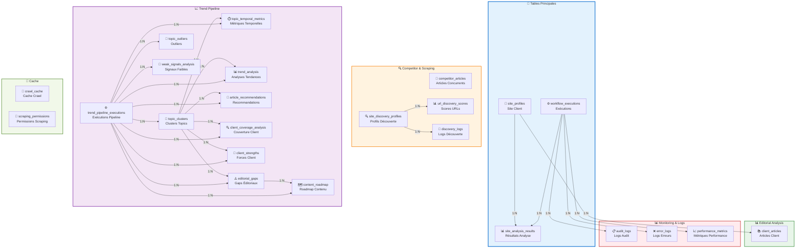

### 2.1.1 Schéma Entité-Relation Détaillé

```mermaid
erDiagram
    %% Tables principales
    site_profiles ||--o{ site_analysis_results : "a plusieurs"
    workflow_executions ||--o{ site_analysis_results : "produit"
    site_profiles ||--o{ client_articles : "contient"
    
    %% Workflow executions et ses relations
    workflow_executions ||--o{ audit_logs : "génère"
    workflow_executions ||--o{ error_logs : "génère"
    workflow_executions ||--o{ performance_metrics : "mesure"
    workflow_executions ||--o| workflow_executions : "parent_execution_id"
    
    %% Trend Pipeline
    trend_pipeline_executions ||--o{ topic_clusters : "génère"
    trend_pipeline_executions ||--o{ topic_outliers : "génère"
    trend_pipeline_executions ||--o{ topic_temporal_metrics : "génère"
    trend_pipeline_executions ||--o{ trend_analysis : "génère"
    trend_pipeline_executions ||--o{ article_recommendations : "génère"
    trend_pipeline_executions ||--o{ weak_signals_analysis : "génère"
    trend_pipeline_executions ||--o{ client_coverage_analysis : "génère"
    trend_pipeline_executions ||--o{ client_strengths : "génère"
    trend_pipeline_executions ||--o{ editorial_gaps : "génère"
    trend_pipeline_executions ||--o{ content_roadmap : "génère"
    
    %% Scraping
    site_discovery_profiles ||--o{ url_discovery_scores : "score"
    site_discovery_profiles ||--o{ discovery_logs : "log"
    
    %% Tables
    site_profiles {
        int id PK
        string domain UK
        timestamp analysis_date
        string language_level
        string editorial_tone
        jsonb target_audience
        jsonb activity_domains
        jsonb content_structure
        jsonb keywords
        jsonb style_features
    }
    
    workflow_executions {
        int id PK
        uuid execution_id UK
        string workflow_type
        string status
        jsonb input_data
        jsonb output_data
        timestamp start_time
        timestamp end_time
        boolean was_success
    }
    
    site_analysis_results {
        int id PK
        int site_profile_id FK
        uuid execution_id FK
        string analysis_phase
        jsonb phase_results
        string llm_model_used
    }
    
    client_articles {
        int id PK
        int site_profile_id FK
        string url UK
        string title
        text content_text
        uuid qdrant_point_id
    }
    
    competitor_articles {
        int id PK
        string domain
        string url UK
        string title
        text content_text
        uuid qdrant_point_id
    }
    
    trend_pipeline_executions {
        int id PK
        uuid execution_id UK
        string client_domain
        jsonb domains_analyzed
        string stage_1_clustering_status
        string stage_2_temporal_status
        string stage_3_llm_status
        string stage_4_gap_status
    }
    
    topic_clusters {
        int id PK
        uuid analysis_id FK
        int topic_id
        string topic_name
        jsonb keywords
        int article_count
    }
    
    topic_temporal_metrics {
        int id PK
        uuid analysis_id FK
        int topic_cluster_id FK
        int volume
        float velocity
        float freshness
    }
    
    trend_analysis {
        int id PK
        uuid analysis_id FK
        int topic_cluster_id FK
        string trend_summary
        jsonb trend_details
    }
    
    article_recommendations {
        int id PK
        uuid analysis_id FK
        int topic_cluster_id FK
        string recommended_title
        jsonb recommended_content
    }
    
    client_coverage_analysis {
        int id PK
        uuid analysis_id FK
        string client_domain
        int topic_cluster_id FK
        float coverage_score
        jsonb coverage_details
    }
    
    client_strengths {
        int id PK
        uuid analysis_id FK
        string client_domain
        int topic_cluster_id FK
        float strength_score
        jsonb strength_details
    }
    
    editorial_gaps {
        int id PK
        uuid analysis_id FK
        string client_domain
        int topic_cluster_id FK
        string gap_type
        jsonb gap_details
    }
    
    content_roadmap {
        int id PK
        uuid analysis_id FK
        string client_domain
        int gap_topic_id FK
        string roadmap_item
        jsonb roadmap_details
    }
    
    site_discovery_profiles {
        int id PK
        string domain UK
        string cms_detected
        boolean has_rest_api
        jsonb api_endpoints
        jsonb sitemap_urls
        jsonb rss_feeds
    }
    
    url_discovery_scores {
        int id PK
        string domain
        string url
        float score
        jsonb score_details
    }
    
    discovery_logs {
        int id PK
        uuid execution_id
        string operation
        jsonb results
    }
    
    audit_logs {
        int id PK
        uuid execution_id FK
        string action
        string status
        text message
    }
    
    error_logs {
        int id PK
        uuid execution_id FK
        string error_type
        text error_message
        string component
    }
    
    performance_metrics {
        int id PK
        uuid execution_id FK
        string metric_type
        float metric_value
    }
```

### 2.2 Flux de Données - Workflow Editorial Analysis

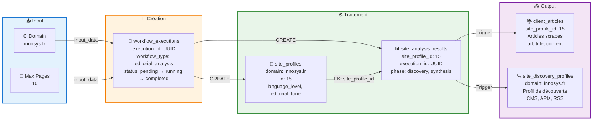

### 2.3 Flux de Données - Trend Pipeline

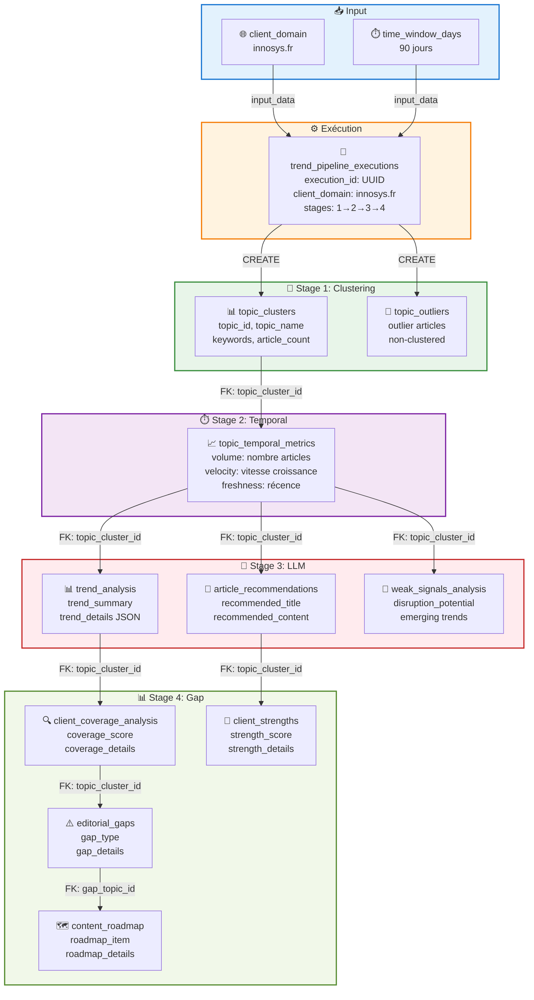

### 2.4 Relations entre Workflows et Site Client

```mermaid
flowchart TB
    subgraph SiteClient["🏢 Site Client"]
        SP[💾 site_profiles<br/>id: 15<br/>domain: innosys.fr<br/>language_level, editorial_tone]
    end
    
    subgraph Workflows["⚙️ Workflows"]
        direction TB
        WE1[📊 workflow_executions<br/>execution_id: e855cd4f-...<br/>type: editorial_analysis<br/>✅ Lié via FK]
        WE2[🔍 workflow_executions<br/>execution_id: 378c14c4-...<br/>type: competitor_search<br/>❌ Référencé dans input_data]
        WE3[🕷️ workflow_executions<br/>execution_id: 19b5ba22-...<br/>type: enhanced_scraping<br/>❌ Référencé dans input_data]
        WE4[📈 workflow_executions<br/>execution_id: 08083962-...<br/>type: trend_pipeline<br/>❌ Référencé dans input_data]
    end
    
    subgraph Results["📊 Résultats"]
        direction TB
        SAR[📋 site_analysis_results<br/>site_profile_id: 15<br/>execution_id: e855cd4f-...<br/>phase: discovery, synthesis]
        CA[📚 client_articles<br/>site_profile_id: 15<br/>Articles du client]
        CompArt[📰 competitor_articles<br/>domain: concurrents<br/>Articles des concurrents]
        TPE[📈 trend_pipeline_executions<br/>client_domain: innosys.fr<br/>Résultats Trend Pipeline]
    end
    
    SP -->|FK: site_profile_id| SAR
    SP -->|FK: site_profile_id| CA
    WE1 -->|FK: execution_id| SAR
    WE2 -.->|input_data.domain<br/>"innosys.fr"| CompArt
    WE3 -.->|input_data.domain<br/>"concurrents"| CompArt
    WE4 -.->|input_data.client_domain<br/>"innosys.fr"| TPE
    
    style SiteClient fill:#e3f2fd,stroke:#1976d2,stroke-width:3px
    style Workflows fill:#fff3e0,stroke:#f57c00,stroke-width:2px
    style Results fill:#e8f5e9,stroke:#388e3c,stroke-width:2px
    style WE1 fill:#50c878,stroke:#2d7a4e,stroke-width:2px,color:#fff
    style WE2 fill:#ff9800,stroke:#cc7700,stroke-width:2px,color:#fff
    style WE3 fill:#ff9800,stroke:#cc7700,stroke-width:2px,color:#fff
    style WE4 fill:#ff9800,stroke:#cc7700,stroke-width:2px,color:#fff
```

---

## 3. Routes API et Fonctionnalités

### 3.1 Liste des Routes Principales

| Route | Méthode | Description | Workflow Type |
|-------|---------|-------------|---------------|
| `/api/v1/health` | GET | Health check | - |
| `/api/v1/sites/analyze` | POST | Analyse éditoriale | `editorial_analysis` |
| `/api/v1/sites/{domain}` | GET | Profil du site | - |
| `/api/v1/competitors/search` | POST | Recherche concurrents | `competitor_search` |
| `/api/v1/competitors/{domain}` | GET | Concurrents d'un domaine | - |
| `/api/v1/discovery/scrape` | POST | Scraping amélioré | `enhanced_scraping` |
| `/api/v1/discovery/{domain}` | GET | Profil de découverte | - |
| `/api/v1/trend-pipeline/analyze` | POST | Analyse des tendances | `trend_pipeline` |
| `/api/v1/trend-pipeline/{execution_id}` | GET | Résultats Trend Pipeline | - |
| `/api/v1/executions/{execution_id}` | GET | Statut d'exécution | - |
| `/api/v1/errors` | GET | Liste des erreurs | - |
| `/api/v1/articles/enrich` | POST | Enrichissement d'articles | - |

### 3.2 Types de Workflows

| Type | Objectif | Tables Principales | Lié à site_profiles ? |
|------|----------|-------------------|----------------------|
| `editorial_analysis` | Analyser le style éditorial | `site_profiles`, `site_analysis_results` | ✅ Oui (via FK) |
| `competitor_search` | Trouver les concurrents | - | ❌ Non (dans input_data) |
| `enhanced_scraping` | Scraper les articles | `competitor_articles`, `client_articles` | ⚠️ Peut-être |
| `trend_pipeline` | Analyser les tendances | `trend_pipeline_executions`, `topic_clusters`, etc. | ❌ Non (dans input_data) |

---

## 4. Explications Détaillées

### 4.1 Relation Site Client ↔ Workflows

**Point important** : Seul le workflow `editorial_analysis` est **directement lié** à `site_profiles` via la table de liaison `site_analysis_results`.

Les autres workflows (`competitor_search`, `enhanced_scraping`, `trend_pipeline`) référencent le domaine client dans leurs données d'entrée (`input_data.domain` ou `input_data.client_domain`) mais ne sont **pas liés** par une clé étrangère.

### 4.2 Flux de Données Typique

1. **Analyse Éditoriale** → Crée/met à jour `site_profiles`
2. **Recherche Concurrents** → Trouve les concurrents (stockés dans `output_data`)
3. **Scraping Amélioré** → Scrape les articles des concurrents → `competitor_articles`
4. **Trend Pipeline** → Analyse les tendances → Tables du Trend Pipeline

### 4.3 Requêtes SQL Utiles

#### Trouver tous les workflows d'un site client

```sql
-- Workflows directement liés (editorial_analysis)
SELECT 
    we.execution_id,
    we.workflow_type,
    we.status,
    we.start_time
FROM workflow_executions we
INNER JOIN site_analysis_results sar 
    ON sar.execution_id = we.execution_id
INNER JOIN site_profiles sp 
    ON sp.id = sar.site_profile_id
WHERE sp.domain = 'innosys.fr';

-- Tous les workflows qui mentionnent le domaine
SELECT 
    execution_id,
    workflow_type,
    status,
    input_data->>'domain' as domain,
    input_data->>'client_domain' as client_domain
FROM workflow_executions
WHERE input_data->>'domain' = 'innosys.fr'
   OR input_data->>'client_domain' = 'innosys.fr';
```

#### Trouver les résultats d'un Trend Pipeline

```sql
SELECT 
    tpe.execution_id,
    tpe.client_domain,
    COUNT(tc.id) as topics_count,
    COUNT(ar.id) as recommendations_count,
    COUNT(eg.id) as gaps_count
FROM trend_pipeline_executions tpe
LEFT JOIN topic_clusters tc ON tc.analysis_id = tpe.execution_id
LEFT JOIN article_recommendations ar ON ar.analysis_id = tpe.execution_id
LEFT JOIN editorial_gaps eg ON eg.analysis_id = tpe.execution_id
WHERE tpe.client_domain = 'innosys.fr'
GROUP BY tpe.execution_id, tpe.client_domain;
```

---

## 5. Résumé

### Points Clés

1. ✅ **4 types de workflows principaux** : `editorial_analysis`, `competitor_search`, `enhanced_scraping`, `trend_pipeline`
2. ✅ **Seul `editorial_analysis` est lié à `site_profiles`** via `site_analysis_results`
3. ✅ **Les autres workflows** référencent le domaine dans `input_data`
4. ✅ **Chaque workflow est indépendant** et peut être exécuté plusieurs fois
5. ✅ **Le Trend Pipeline** a sa propre table d'exécution (`trend_pipeline_executions`)

### Architecture

- **API FastAPI** avec routes modulaires
- **Agents Multi-LLM** pour l'analyse
- **PostgreSQL** pour la persistance
- **Qdrant** pour les embeddings vectoriels
- **Services externes** : Tavily, DuckDuckGo

---

## 6. Diagramme Visuel - Cycle de Vie Complet

### 6.1 Cycle de Vie d'un Workflow Editorial Analysis

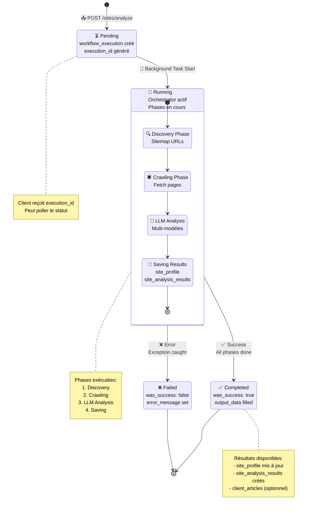

### 6.2 Vue d'Ensemble Visuelle - Architecture Complète

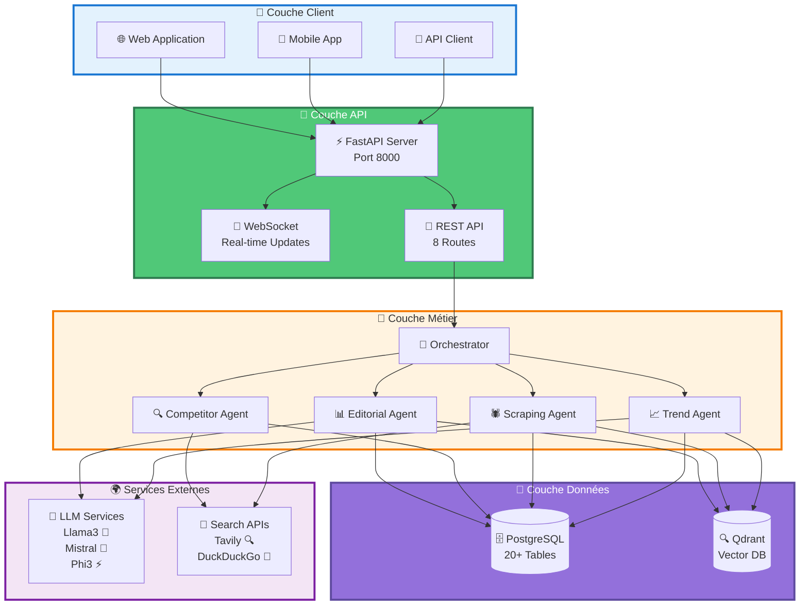

### 6.3 Flux de Données Visuel - End-to-End

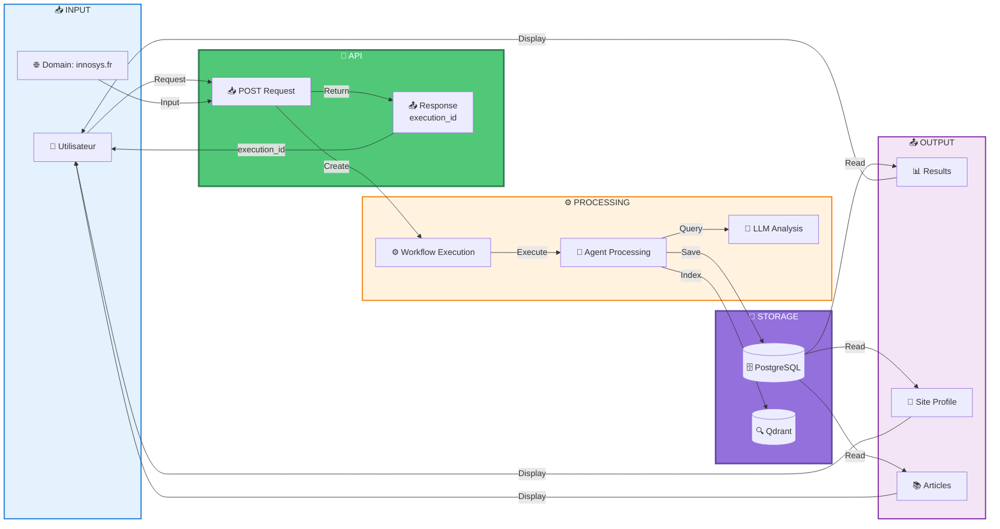

---

## 7. Diagramme de Flux Principal - Workflow Complet (Style Processus)

### 7.1 Workflow Principal - De la Demande au Résultat Final

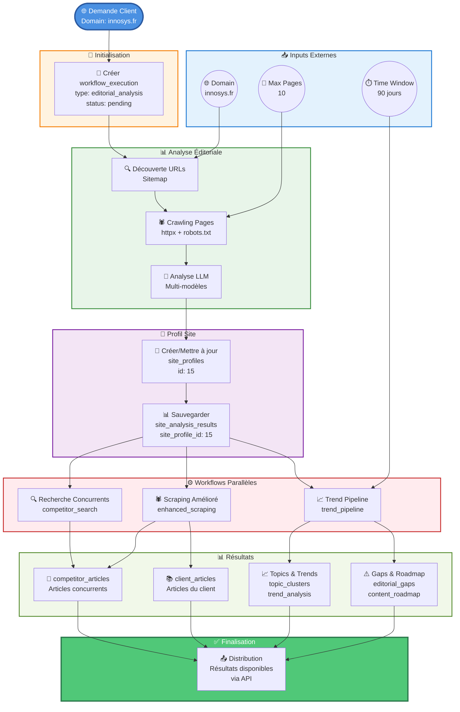

### 7.2 Workflow Détaillé - Relations Site Client et Workflows

```mermaid
flowchart TD
    ClientRequest([👤 Demande Client<br/>POST /sites/analyze<br/>domain: innosys.fr])
    
    subgraph ExternalInputs["📥 Inputs Externes"]
        DomainInput((🌐 Domain<br/>innosys.fr))
        ConfigInput((⚙️ Configuration<br/>max_pages: 10))
    end
    
    subgraph Creation["📝 Création"]
        WorkflowExec[📝 workflow_executions<br/>execution_id: UUID<br/>workflow_type: editorial_analysis<br/>status: pending → running]
    end
    
    subgraph Processing["⚙️ Traitement"]
        SiteProfile[🏢 site_profiles<br/>id: 15<br/>domain: innosys.fr<br/>language_level, editorial_tone]
        AnalysisResults[📊 site_analysis_results<br/>site_profile_id: 15<br/>execution_id: UUID<br/>phase: discovery, synthesis]
    end
    
    subgraph ParallelWorkflows["⚙️ Workflows Parallèles"]
        direction TB
        W1[🔍 competitor_search<br/>Recherche concurrents<br/>execution_id: 378c14c4-...]
        W2[🕷️ enhanced_scraping<br/>Scraping amélioré<br/>execution_id: 19b5ba22-...]
        W3[📈 trend_pipeline<br/>Analyse tendances<br/>execution_id: 08083962-...]
    end
    
    subgraph DataStorage["💾 Stockage Données"]
        direction TB
        ClientArts[📚 client_articles<br/>site_profile_id: 15<br/>Articles client]
        CompArts[📰 competitor_articles<br/>domain: concurrents<br/>Articles concurrents]
        TrendData[📈 Trend Pipeline Data<br/>topic_clusters<br/>trend_analysis<br/>editorial_gaps]
    end
    
    subgraph FinalOutput["📤 Résultats Finaux"]
        APIResponse[📡 API Response<br/>GET /sites/innosys.fr<br/>GET /trend-pipeline/{id}]
    end
    
    ClientRequest --> WorkflowExec
    DomainInput --> SiteProfile
    ConfigInput --> WorkflowExec
    
    WorkflowExec --> SiteProfile
    WorkflowExec --> AnalysisResults
    SiteProfile --> AnalysisResults
    
    AnalysisResults -.->|Déclenche| W1
    AnalysisResults -.->|Déclenche| W2
    AnalysisResults -.->|Déclenche| W3
    
    W1 --> CompArts
    W2 --> CompArts
    W2 --> ClientArts
    W3 --> TrendData
    
    SiteProfile --> APIResponse
    ClientArts --> APIResponse
    CompArts --> APIResponse
    TrendData --> APIResponse
    
    style ClientRequest fill:#4a90e2,stroke:#2c5aa0,stroke-width:3px,color:#fff
    style ExternalInputs fill:#e3f2fd,stroke:#1976d2,stroke-width:2px
    style Creation fill:#fff3e0,stroke:#f57c00,stroke-width:2px
    style Processing fill:#e8f5e9,stroke:#388e3c,stroke-width:2px
    style ParallelWorkflows fill:#ffebee,stroke:#c62828,stroke-width:2px
    style DataStorage fill:#f3e5f5,stroke:#7b1fa2,stroke-width:2px
    style FinalOutput fill:#50c878,stroke:#2d7a4e,stroke-width:3px,color:#fff
```

### 7.3 Workflow Trend Pipeline - 4 Stages Détaillés

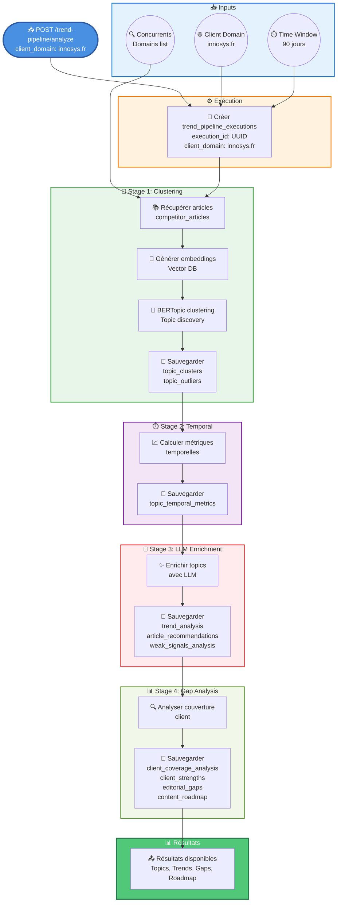

---

**Date de création** : 2025-12-10  
**Version** : 1.0.0  
**Dernière mise à jour** : 2025-12-10


