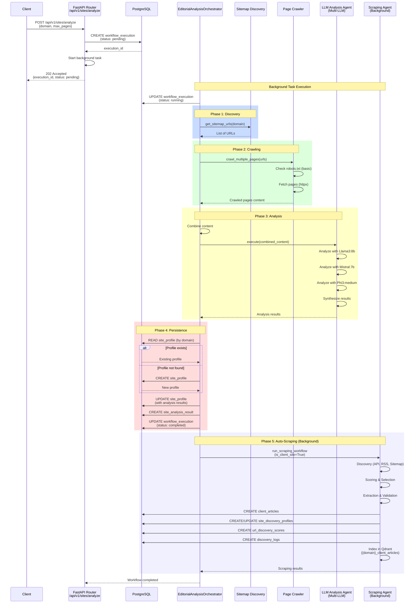
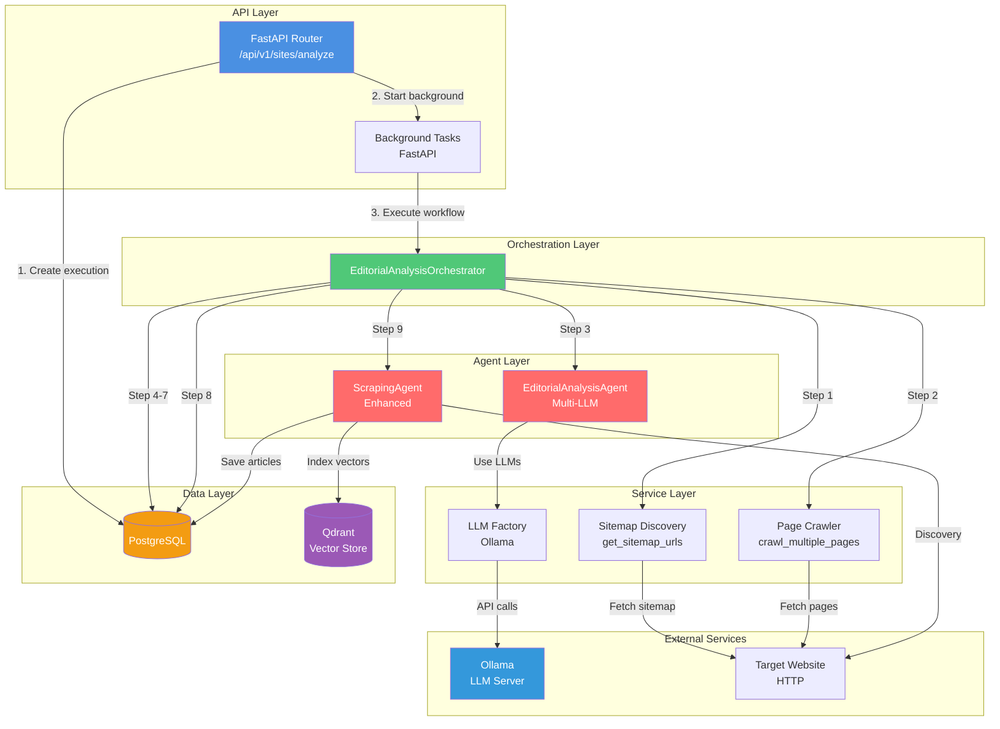
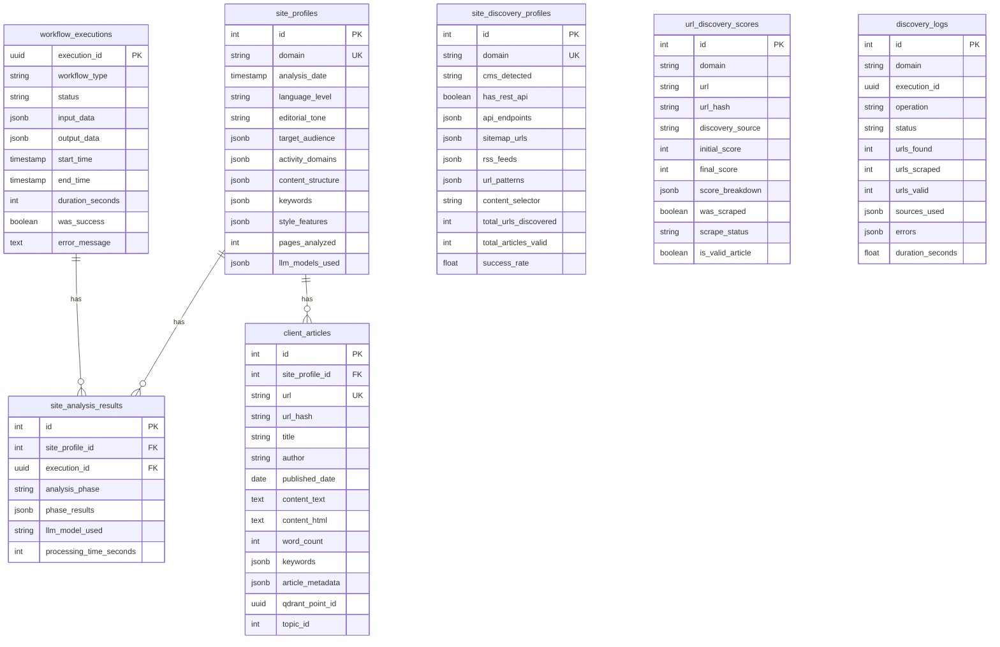
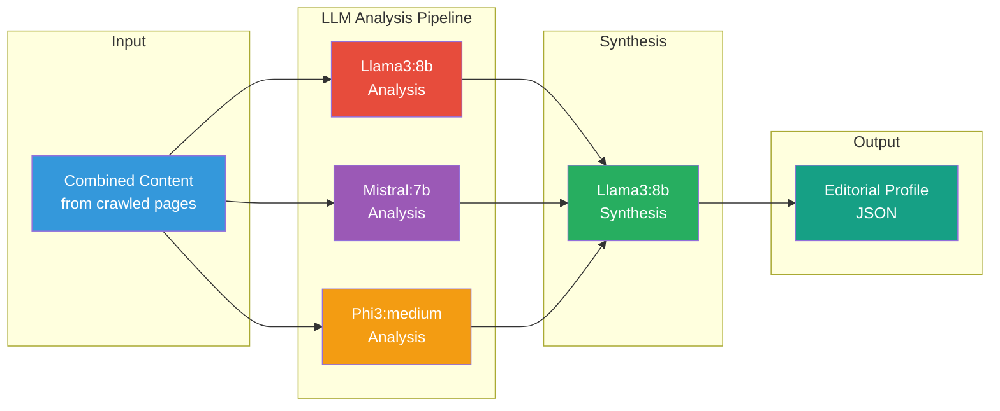
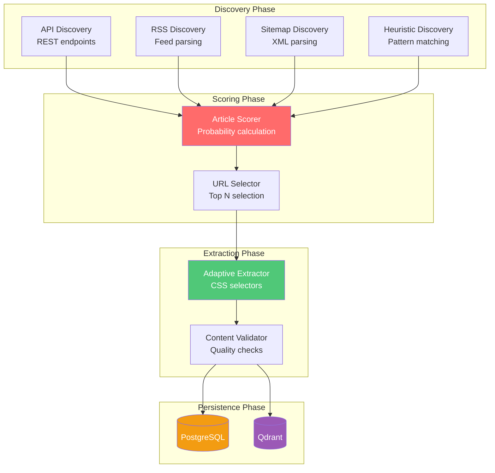

# Diagramme d'Architecture - Route POST /api/v1/sites/analyze

## Vue d'ensemble

Ce document présente l'architecture complète de la route `POST /api/v1/sites/analyze` avec des diagrammes de séquence, de composants et de flux de données.

## Diagramme de Séquence



## Diagramme de Composants



## Diagramme de Flux de Données

```mermaid
flowchart TD
    START([Client Request<br/>POST /api/v1/sites/analyze])
    
    CREATE_EXEC[Create workflow_execution<br/>status: pending]
    
    START --> CREATE_EXEC
    
    CREATE_EXEC --> DISCOVER[Step 1: Discover URLs<br/>via Sitemap]
    
    DISCOVER --> CRAWL[Step 2: Crawl Pages<br/>httpx + robots.txt check]
    
    CRAWL --> COMBINE[Step 3: Combine Content<br/>Merge all pages text]
    
    COMBINE --> LLM_ANALYSIS[Step 4: LLM Analysis<br/>Multi-LLM: Llama3, Mistral, Phi3]
    
    LLM_ANALYSIS --> CHECK_PROFILE{Profile<br/>exists?}
    
    CHECK_PROFILE -->|No| CREATE_PROFILE[Step 5: Create<br/>site_profile]
    CHECK_PROFILE -->|Yes| UPDATE_PROFILE[Step 6: Update<br/>site_profile]
    
    CREATE_PROFILE --> UPDATE_PROFILE
    
    UPDATE_PROFILE --> SAVE_RESULTS[Step 7: Save<br/>site_analysis_result]
    
    SAVE_RESULTS --> UPDATE_EXEC[Step 8: Update execution<br/>status: completed]
    
    UPDATE_EXEC --> SCRAPE[Step 9: Auto-Scraping<br/>Background Task]
    
    SCRAPE --> DISCOVERY[Discovery Phase<br/>API, RSS, Sitemap]
    DISCOVERY --> SCORING[Scoring Phase<br/>Article probability]
    SCORING --> EXTRACTION[Extraction Phase<br/>Adaptive extractors]
    EXTRACTION --> VALIDATION[Validation Phase<br/>Content quality]
    
    VALIDATION --> SAVE_ARTICLES[Save client_articles]
    VALIDATION --> SAVE_PROFILES[Save discovery profiles]
    VALIDATION --> SAVE_SCORES[Save URL scores]
    VALIDATION --> SAVE_LOGS[Save discovery logs]
    
    SAVE_ARTICLES --> INDEX_QDRANT[Index in Qdrant<br/>{domain}_client_articles]
    
    SAVE_PROFILES --> END_SUCCESS([Success])
    SAVE_SCORES --> END_SUCCESS
    SAVE_LOGS --> END_SUCCESS
    INDEX_QDRANT --> END_SUCCESS
    
    UPDATE_EXEC -.->|If error| ERROR_HANDLER[Error Handler<br/>Update status: failed]
    ERROR_HANDLER --> END_ERROR([Error Response])
    
    style START fill:#4a90e2,color:#fff
    style LLM_ANALYSIS fill:#ff6b6b,color:#fff
    style SCRAPE fill:#50c878,color:#fff
    style END_SUCCESS fill:#50c878,color:#fff
    style END_ERROR fill:#e74c3c,color:#fff
```

## Architecture des Tables de Base de Données



## Architecture LLM Multi-Modèle



## Architecture du Scraping Automatique



## Légende des Couleurs

- 🔵 **Bleu** : Points d'entrée/sortie (API, Client)
- 🟢 **Vert** : Orchestration et workflow
- 🔴 **Rouge** : Agents et traitement LLM
- 🟡 **Jaune** : Base de données PostgreSQL
- 🟣 **Violet** : Qdrant (Vector Store)
- 🔵 **Bleu clair** : Services externes

## Notes d'Architecture

### Points Clés

1. **Asynchrone** : La route retourne immédiatement un `execution_id` et le traitement se fait en arrière-plan
2. **Multi-LLM** : Utilise 3 modèles LLM différents pour une analyse robuste
3. **Scraping Automatique** : Lance automatiquement le scraping du site client après l'analyse
4. **Gestion d'Erreurs** : Les erreurs de scraping n'interrompent pas le workflow principal
5. **Collections Qdrant** : Les articles clients sont indexés dans une collection spécifique par domaine : `{domain}_client_articles`

### Performance

- **Temps typique** : 2-5 minutes pour l'analyse complète
- **Parallélisation** : Les analyses LLM peuvent être parallélisées
- **Cache** : Les tables de cache (`scraping_permissions`, `crawl_cache`) ne sont pas utilisées dans ce workflow

### Scalabilité

- **Background Tasks** : Utilise FastAPI BackgroundTasks pour ne pas bloquer l'API
- **Base de données** : Utilise des sessions async pour la performance
- **Qdrant** : Collections séparées par domaine pour l'isolation


