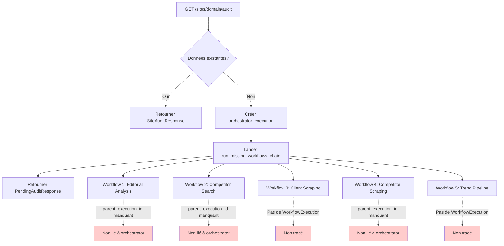
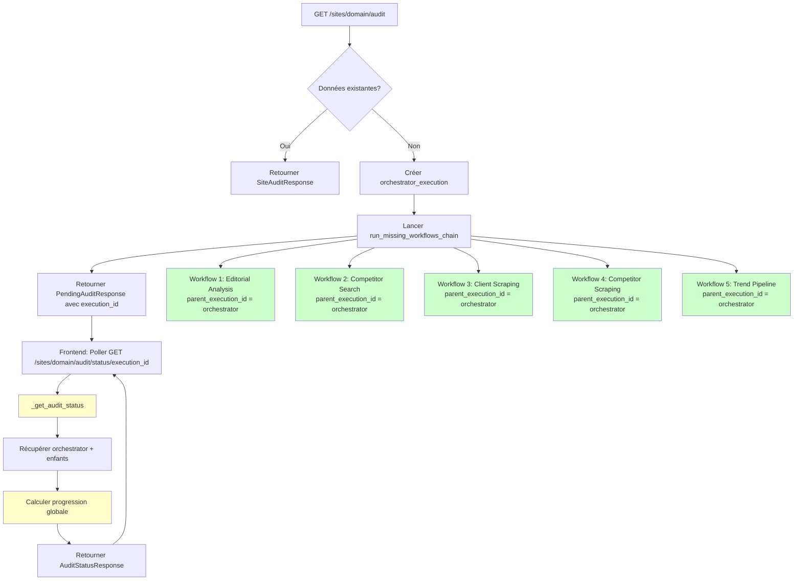
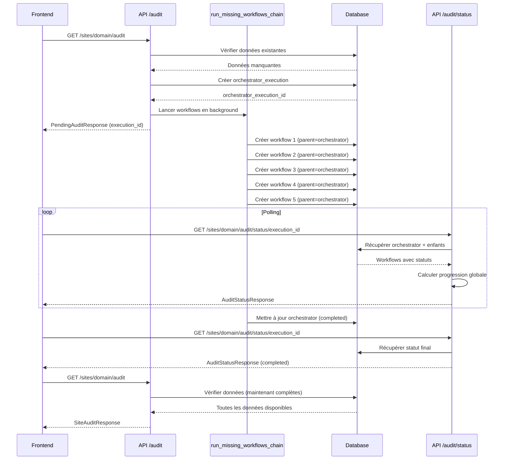

# Issue #004 : Amélioration de la gestion des WorkflowExecution pour la route /audit

**Date de création** : 2025-01-27  
**Date d'implémentation** : _À définir_  
**Statut** : En attente  
**Priorité** : Haute  
**Type** : Amélioration / Feature  
**Labels** : `api`, `workflow-execution`, `audit`, `monitoring`, `frontend-integration`

---

## Contexte

Lors de l'appel à la route `GET /api/v1/sites/{domain}/audit`, plusieurs workflows peuvent être lancés en arrière-plan pour collecter les données manquantes (analyse éditoriale, recherche de concurrents, scraping, pipeline de tendances). Actuellement, il n'existe pas de mécanisme pour suivre la progression globale de l'audit et obtenir un statut détaillé de chaque étape.

### Problème actuel

1. **Workflows non liés** : Les workflows enfants créés dans `run_missing_workflows_chain` ne sont pas tous liés à l'orchestrator via `parent_execution_id`
   - Seuls certains workflows (editorial_analysis, competitor_search, enhanced_scraping) sont créés avec un `parent_execution_id`
   - Les workflows `client_scraping` et `trend_pipeline` ne sont pas liés à l'orchestrator
   - Impossible de récupérer tous les workflows enfants d'un audit

2. **Pas de route de statut global** : Il n'existe pas de route dédiée pour récupérer le statut global de l'audit
   - Le frontend doit poller plusieurs endpoints différents
   - Pas de vue d'ensemble de la progression
   - Impossible de savoir quelle étape est en cours

3. **Pas de calcul de progression** : Aucun calcul de progression globale n'est effectué
   - Impossible d'afficher une barre de progression
   - Pas d'estimation du temps restant
   - Le frontend ne peut pas informer l'utilisateur de l'avancement

4. **Statuts des étapes non mis à jour** : Les statuts des étapes dans `PendingAuditResponse` ne sont pas mis à jour en temps réel
   - Les `WorkflowStep` retournés initialement restent statiques
   - Le frontend ne peut pas savoir quand une étape passe de "pending" à "running" puis "completed"

### Impact

- **Expérience utilisateur dégradée** : L'utilisateur ne sait pas où en est l'audit
- **Polling inefficace** : Le frontend doit faire plusieurs requêtes pour obtenir des informations partielles
- **Difficulté de débogage** : Impossible de voir facilement l'état de tous les workflows d'un audit
- **Manque de visibilité** : Pas de métriques sur la durée des audits ou les étapes qui échouent

---

## Objectif

Améliorer la gestion des `WorkflowExecution` pour la route `/audit` afin de permettre :

1. **Suivi global** : Avoir une vue d'ensemble de la progression de l'audit avec tous ses workflows
2. **Progression en temps réel** : Calculer et exposer la progression globale (0-100%)
3. **Statut détaillé par étape** : Connaître le statut, la progression et les erreurs de chaque workflow
4. **Estimation du temps** : Estimer le temps restant basé sur les durées moyennes
5. **Liaison parent-enfant** : Tous les workflows enfants doivent être liés à l'orchestrator

---

## Analyse technique

### Workflow actuel de la route /audit



### Problèmes identifiés dans le code

**Fichier** : `python_scripts/api/routers/sites.py`

1. **Ligne 2156-2161** : `editorial_analysis` créé sans `parent_execution_id`
   ```python
   analysis_execution = await create_workflow_execution(
       db,
       workflow_type="editorial_analysis",
       input_data={"domain": domain, "max_pages": 50},
       status="pending",
       # ❌ parent_execution_id manquant
   )
   ```

2. **Ligne 2181-2186** : `competitor_search` créé sans `parent_execution_id`
   ```python
   competitor_execution = await create_workflow_execution(
       db,
       workflow_type="competitor_search",
       input_data={"domain": domain, "max_competitors": 20},
       status="pending",
       # ❌ parent_execution_id manquant
   )
   ```

3. **Ligne 2198-2210** : `client_scraping` n'a pas de `WorkflowExecution` créé
   ```python
   # ❌ Pas de create_workflow_execution pour client_scraping
   scraping_agent = EnhancedScrapingAgent(min_word_count=150)
   await scraping_agent.discover_and_scrape_articles(...)
   ```

4. **Ligne 2238-2247** : `enhanced_scraping` créé sans `parent_execution_id`
   ```python
   scraping_execution = await create_workflow_execution(
       db,
       workflow_type="enhanced_scraping",
       input_data={...},
       status="pending",
       # ❌ parent_execution_id manquant
   )
   ```

5. **Ligne 2268-2312** : `trend_pipeline` n'a pas de `WorkflowExecution` lié à l'orchestrator
   ```python
   # ❌ Pas de create_workflow_execution pour trend_pipeline
   # Utilise TrendPipelineExecution mais pas lié à orchestrator
   ```

### Structure de données actuelle

**WorkflowExecution** (modèle existant) :
- `execution_id` : UUID unique
- `workflow_type` : Type de workflow
- `status` : pending, running, completed, failed
- `parent_execution_id` : UUID du workflow parent (nullable)
- `start_time`, `end_time`, `duration_seconds`
- `error_message`

**PendingAuditResponse** (schéma actuel) :
- `status` : "pending"
- `execution_id` : ID de l'orchestrator
- `workflow_steps` : Liste de `WorkflowStep` (statique)
- `data_status` : Statut des données

**WorkflowStep** (schéma actuel) :
- `step` : Numéro d'étape
- `name` : Nom de l'étape
- `status` : pending, running, completed, failed
- `execution_id` : Optionnel

---

## Solutions proposées

### Option 1 : Amélioration complète avec route de statut ⭐ **RECOMMANDÉE**

**Principe** : 
- Lier tous les workflows enfants à l'orchestrator
- Créer une route dédiée pour le statut global
- Calculer la progression en temps réel
- Mettre à jour les schémas de réponse

**Avantages** :
- ✅ Vue d'ensemble complète de l'audit
- ✅ Progression calculée automatiquement
- ✅ Facilite l'intégration frontend
- ✅ Permet le polling efficace

**Inconvénients** :
- ⚠️ Nécessite des modifications dans plusieurs fichiers
- ⚠️ Ajoute de la complexité

### Option 2 : Amélioration minimale (liaison seulement)

**Principe** : Seulement lier les workflows enfants sans route de statut

**Avantages** :
- ✅ Changements minimaux
- ✅ Facilite le débogage

**Inconvénients** :
- ❌ Pas de progression globale
- ❌ Frontend doit toujours faire plusieurs requêtes
- ❌ Pas d'amélioration UX significative

### Option 3 : Route de statut sans liaison complète

**Principe** : Créer la route de statut mais sans lier tous les workflows

**Avantages** :
- ✅ Route de statut disponible

**Inconvénients** :
- ❌ Données incomplètes
- ❌ Nécessite des requêtes complexes pour trouver les workflows
- ❌ Pas de hiérarchie claire

---

## Recommandation : Option 1

### Implémentation détaillée

#### 1. Modifier `run_missing_workflows_chain` pour lier tous les workflows

**Fichier** : `python_scripts/api/routers/sites.py`

**Changements** :

1. **Étape 1 - Editorial Analysis** (ligne ~2156) :
   ```python
   analysis_execution = await create_workflow_execution(
       db,
       workflow_type="editorial_analysis",
       input_data={"domain": domain, "max_pages": 50},
       status="pending",
       parent_execution_id=orchestrator_execution_id,  # ✅ Ajouter
   )
   ```

2. **Étape 2 - Competitor Search** (ligne ~2181) :
   ```python
   competitor_execution = await create_workflow_execution(
       db,
       workflow_type="competitor_search",
       input_data={"domain": domain, "max_competitors": 20},
       status="pending",
       parent_execution_id=orchestrator_execution_id,  # ✅ Ajouter
   )
   ```

3. **Étape 3 - Client Scraping** (ligne ~2198) :
   ```python
   if needs_client_scraping and current_profile_id:
       logger.info("Step 3: Starting client site scraping", domain=domain)
       
       # ✅ Créer un WorkflowExecution pour le client scraping
       client_scraping_execution = await create_workflow_execution(
           db,
           workflow_type="client_scraping",
           input_data={"domain": domain, "max_articles": 100},
           status="running",
           parent_execution_id=orchestrator_execution_id,
       )
       
       scraping_agent = EnhancedScrapingAgent(min_word_count=150)
       try:
           await scraping_agent.discover_and_scrape_articles(
               db,
               domain,
               max_articles=100,
               is_client_site=True,
               site_profile_id=current_profile_id,
               force_reprofile=False,
           )
           await update_workflow_execution(
               db,
               client_scraping_execution,
               status="completed",
           )
       except Exception as e:
           await update_workflow_execution(
               db,
               client_scraping_execution,
               status="failed",
               error_message=str(e),
           )
           raise
   ```

4. **Étape 4 - Competitor Scraping** (ligne ~2238) :
   ```python
   scraping_execution = await create_workflow_execution(
       db,
       workflow_type="enhanced_scraping",
       input_data={
           "client_domain": domain,
           "domains": competitor_domains,
           "max_articles": 100,
       },
       status="pending",
       parent_execution_id=orchestrator_execution_id,  # ✅ Ajouter
   )
   ```

5. **Étape 5 - Trend Pipeline** (ligne ~2268) :
   ```python
   if needs_trend_pipeline:
       logger.info("Step 5: Starting trend pipeline", domain=domain)
       
       # ✅ Créer un WorkflowExecution pour le trend pipeline
       trend_execution = await create_workflow_execution(
           db,
           workflow_type="trend_pipeline",
           input_data={
               "client_domain": domain,
               "time_window_days": 90,
           },
           status="running",
           parent_execution_id=orchestrator_execution_id,
       )
       
       try:
           from uuid import uuid4
           from python_scripts.api.routers.trend_pipeline import (
               TrendPipelineRequest,
               run_trend_pipeline_task,
           )
           
           execution_id = str(uuid4())
           request = TrendPipelineRequest(
               client_domain=domain,
               time_window_days=90,
               skip_llm=False,
               skip_gap_analysis=False,
           )
           
           await run_trend_pipeline_task(
               request=request,
               db=db,
               execution_id=execution_id,
           )
           
           # Attendre la completion
           # ... code existant ...
           
           await update_workflow_execution(
               db,
               trend_execution,
               status="completed",
           )
       except Exception as e:
           await update_workflow_execution(
               db,
               trend_execution,
               status="failed",
               error_message=str(e),
           )
           raise
   ```

#### 2. Ajouter les nouveaux schémas de réponse

**Fichier** : `python_scripts/api/schemas/responses.py`

**Ajouts** :

```python
class WorkflowStepDetail(BaseModel):
    """Détails d'une étape de workflow avec progression."""
    
    step: int = Field(..., description="Numéro de l'étape")
    name: str = Field(..., description="Nom de l'étape")
    workflow_type: str = Field(..., description="Type de workflow")
    status: Literal["pending", "running", "completed", "failed"] = Field(
        ..., description="Statut de l'étape"
    )
    execution_id: Optional[str] = Field(None, description="ID d'exécution")
    start_time: Optional[datetime] = Field(None, description="Heure de début")
    end_time: Optional[datetime] = Field(None, description="Heure de fin")
    duration_seconds: Optional[int] = Field(None, description="Durée en secondes")
    error_message: Optional[str] = Field(None, description="Message d'erreur si échec")
    progress_percentage: Optional[float] = Field(
        None, 
        description="Pourcentage de progression (0-100)",
        ge=0,
        le=100
    )


class AuditStatusResponse(BaseModel):
    """Réponse pour le statut global de l'audit."""
    
    orchestrator_execution_id: str = Field(..., description="ID de l'orchestrator")
    domain: str = Field(..., description="Domaine analysé")
    overall_status: Literal["pending", "running", "completed", "failed", "partial"] = Field(
        ..., description="Statut global"
    )
    overall_progress: float = Field(
        ..., 
        description="Progression globale (0-100)",
        ge=0,
        le=100
    )
    total_steps: int = Field(..., description="Nombre total d'étapes")
    completed_steps: int = Field(..., description="Nombre d'étapes complétées")
    failed_steps: int = Field(..., description="Nombre d'étapes échouées")
    running_steps: int = Field(..., description="Nombre d'étapes en cours")
    pending_steps: int = Field(..., description="Nombre d'étapes en attente")
    workflow_steps: List[WorkflowStepDetail] = Field(
        ..., 
        description="Détails de chaque étape"
    )
    start_time: Optional[datetime] = Field(None, description="Heure de début globale")
    estimated_completion_time: Optional[datetime] = Field(
        None, 
        description="Estimation de fin"
    )
    data_status: DataStatus = Field(..., description="Statut des données")
```

#### 3. Créer la fonction `_get_audit_status`

**Fichier** : `python_scripts/api/routers/sites.py`

**Fonction** :

```python
async def _get_audit_status(
    db: AsyncSession,
    orchestrator_execution_id: UUID,
    domain: str,
) -> AuditStatusResponse:
    """
    Récupère le statut global de l'audit avec tous les workflows enfants.
    
    Args:
        db: Session de base de données
        orchestrator_execution_id: ID de l'orchestrator
        domain: Domaine analysé
        
    Returns:
        Statut global de l'audit
    """
    from sqlalchemy import select
    from python_scripts.database.models import WorkflowExecution
    from python_scripts.database.crud_executions import get_workflow_execution
    from datetime import timedelta
    
    # Récupérer l'orchestrator
    orchestrator = await get_workflow_execution(db, orchestrator_execution_id)
    if not orchestrator:
        raise HTTPException(
            status_code=404,
            detail=f"Orchestrator execution not found: {orchestrator_execution_id}"
        )
    
    # Récupérer tous les workflows enfants
    stmt = (
        select(WorkflowExecution)
        .where(
            WorkflowExecution.parent_execution_id == orchestrator_execution_id,
            WorkflowExecution.is_valid == True,
        )
        .order_by(WorkflowExecution.created_at)
    )
    result = await db.execute(stmt)
    child_workflows = list(result.scalars().all())
    
    # Mapper les types de workflow vers les noms d'étapes
    workflow_type_to_step = {
        "editorial_analysis": {"step": 1, "name": "Editorial Analysis"},
        "competitor_search": {"step": 2, "name": "Competitor Search"},
        "client_scraping": {"step": 3, "name": "Client Site Scraping"},
        "enhanced_scraping": {"step": 4, "name": "Competitor Scraping"},
        "trend_pipeline": {"step": 5, "name": "Trend Pipeline"},
    }
    
    # Construire la liste des étapes
    workflow_steps = []
    now = datetime.now(timezone.utc)
    
    for child in child_workflows:
        step_info = workflow_type_to_step.get(child.workflow_type, {
            "step": len(workflow_steps) + 1,
            "name": child.workflow_type.replace("_", " ").title()
        })
        
        # Calculer le pourcentage de progression pour cette étape
        progress = None
        if child.status == "completed":
            progress = 100.0
        elif child.status == "running":
            # Estimation basée sur le type de workflow et le temps écoulé
            if child.start_time:
                elapsed = (now - child.start_time).total_seconds()
                estimated_duration = {
                    "editorial_analysis": 600,  # 10 minutes
                    "competitor_search": 300,  # 5 minutes
                    "client_scraping": 180,    # 3 minutes
                    "enhanced_scraping": 600,   # 10 minutes
                    "trend_pipeline": 1200,    # 20 minutes
                }.get(child.workflow_type, 300)
                progress = min(90.0, (elapsed / estimated_duration) * 100)
            else:
                progress = 10.0
        elif child.status == "failed":
            progress = 0.0
        else:
            progress = 0.0
        
        workflow_steps.append(
            WorkflowStepDetail(
                step=step_info["step"],
                name=step_info["name"],
                workflow_type=child.workflow_type,
                status=child.status,
                execution_id=str(child.execution_id),
                start_time=child.start_time,
                end_time=child.end_time,
                duration_seconds=child.duration_seconds,
                error_message=child.error_message,
                progress_percentage=round(progress, 2),
            )
        )
    
    # Calculer les statistiques globales
    total_steps = len(workflow_steps)
    completed_steps = sum(1 for s in workflow_steps if s.status == "completed")
    failed_steps = sum(1 for s in workflow_steps if s.status == "failed")
    running_steps = sum(1 for s in workflow_steps if s.status == "running")
    pending_steps = sum(1 for s in workflow_steps if s.status == "pending")
    
    # Calculer la progression globale
    if total_steps > 0:
        overall_progress = (completed_steps / total_steps) * 100
        # Ajouter une partie de la progression des étapes en cours
        if running_steps > 0:
            running_progress = sum(
                s.progress_percentage or 0 
                for s in workflow_steps 
                if s.status == "running"
            ) / running_steps
            overall_progress += (running_progress / total_steps) * (running_steps / total_steps) * 100
    else:
        overall_progress = 0.0
    
    overall_progress = min(100.0, overall_progress)
    
    # Déterminer le statut global
    if orchestrator.status == "completed":
        overall_status = "completed"
    elif orchestrator.status == "failed":
        overall_status = "failed"
    elif failed_steps > 0 and completed_steps < total_steps:
        overall_status = "partial"
    elif running_steps > 0 or orchestrator.status == "running":
        overall_status = "running"
    else:
        overall_status = "pending"
    
    # Estimer le temps de fin
    estimated_completion = None
    if overall_status in ("running", "pending") and orchestrator.start_time:
        # Estimation basée sur les étapes restantes
        remaining_steps = total_steps - completed_steps
        avg_duration_per_step = 300  # 5 minutes par défaut
        if completed_steps > 0:
            avg_duration = sum(
                s.duration_seconds or 0 
                for s in workflow_steps 
                if s.status == "completed"
            ) / completed_steps
            avg_duration_per_step = avg_duration if avg_duration > 0 else 300
        
        estimated_remaining_seconds = remaining_steps * avg_duration_per_step
        estimated_completion = now + timedelta(seconds=estimated_remaining_seconds)
    
    # Récupérer le statut des données
    profile = await _check_site_profile(db, domain)
    competitors_execution = await _check_competitors(db, domain) if profile else None
    
    client_articles_count = 0
    has_client_articles = False
    if profile:
        count, is_sufficient = await _check_client_articles(db, profile.id)
        client_articles_count = count
        has_client_articles = is_sufficient
    
    competitor_articles_count = 0
    has_competitor_articles = False
    if competitors_execution:
        competitors_data = competitors_execution.output_data.get("competitors", [])
        competitor_domains = [
            c.get("domain")
            for c in competitors_data
            if c.get("domain")
            and not c.get("excluded", False)
            and (c.get("validated", False) or c.get("manual", False))
        ]
        if competitor_domains:
            count, is_sufficient = await _check_competitor_articles(db, competitor_domains)
            competitor_articles_count = count
            has_competitor_articles = is_sufficient
    
    trend_execution = await _check_trend_pipeline(db, domain) if profile else None
    
    data_status = DataStatus(
        has_profile=profile is not None,
        has_competitors=competitors_execution is not None,
        has_client_articles=has_client_articles,
        has_competitor_articles=has_competitor_articles,
        has_trend_pipeline=trend_execution is not None,
    )
    
    return AuditStatusResponse(
        orchestrator_execution_id=str(orchestrator_execution_id),
        domain=domain,
        overall_status=overall_status,
        overall_progress=round(overall_progress, 2),
        total_steps=total_steps,
        completed_steps=completed_steps,
        failed_steps=failed_steps,
        running_steps=running_steps,
        pending_steps=pending_steps,
        workflow_steps=workflow_steps,
        start_time=orchestrator.start_time,
        estimated_completion_time=estimated_completion,
        data_status=data_status,
    )
```

#### 4. Créer la route `GET /{domain}/audit/status/{execution_id}`

**Fichier** : `python_scripts/api/routers/sites.py`

**Route** :

```python
@router.get(
    "/{domain}/audit/status/{execution_id}",
    response_model=AuditStatusResponse,
    summary="Get audit execution status",
    description="""
    Récupère le statut global de l'audit avec tous les workflows enfants.
    
    Cette route permet de suivre la progression de l'audit en temps réel,
    avec le statut détaillé de chaque étape et une progression globale.
    
    Utilisez cette route pour poller le statut de l'audit après avoir reçu
    un `PendingAuditResponse` avec un `execution_id`.
    """,
    tags=["sites"],
)
async def get_audit_status(
    domain: str,
    execution_id: UUID,
    db: AsyncSession = Depends(get_db),
) -> AuditStatusResponse:
    """
    Récupère le statut global de l'audit.
    
    Args:
        domain: Domaine analysé
        execution_id: ID de l'orchestrator execution
        db: Session de base de données
        
    Returns:
        Statut global de l'audit avec détails de chaque étape
        
    Raises:
        HTTPException: 404 si l'orchestrator n'est pas trouvé
    """
    return await _get_audit_status(db, execution_id, domain)
```

#### 5. Mettre à jour les imports

**Fichier** : `python_scripts/api/routers/sites.py`

**Ajouts dans les imports** :

```python
from python_scripts.api.schemas.responses import (
    # ... imports existants ...
    AuditStatusResponse,
    WorkflowStepDetail,
)
```

---

## Flux amélioré



---

## Structure de données

### AuditStatusResponse

```json
{
  "orchestrator_execution_id": "123e4567-e89b-12d3-a456-426614174000",
  "domain": "innosys.fr",
  "overall_status": "running",
  "overall_progress": 45.5,
  "total_steps": 5,
  "completed_steps": 2,
  "failed_steps": 0,
  "running_steps": 1,
  "pending_steps": 2,
  "workflow_steps": [
    {
      "step": 1,
      "name": "Editorial Analysis",
      "workflow_type": "editorial_analysis",
      "status": "completed",
      "execution_id": "abc-123",
      "start_time": "2025-01-27T10:00:00Z",
      "end_time": "2025-01-27T10:08:30Z",
      "duration_seconds": 510,
      "error_message": null,
      "progress_percentage": 100.0
    },
    {
      "step": 2,
      "name": "Competitor Search",
      "workflow_type": "competitor_search",
      "status": "completed",
      "execution_id": "def-456",
      "start_time": "2025-01-27T10:08:30Z",
      "end_time": "2025-01-27T10:12:15Z",
      "duration_seconds": 225,
      "error_message": null,
      "progress_percentage": 100.0
    },
    {
      "step": 3,
      "name": "Client Site Scraping",
      "workflow_type": "client_scraping",
      "status": "running",
      "execution_id": "ghi-789",
      "start_time": "2025-01-27T10:12:15Z",
      "end_time": null,
      "duration_seconds": null,
      "error_message": null,
      "progress_percentage": 65.0
    },
    {
      "step": 4,
      "name": "Competitor Scraping",
      "workflow_type": "enhanced_scraping",
      "status": "pending",
      "execution_id": null,
      "start_time": null,
      "end_time": null,
      "duration_seconds": null,
      "error_message": null,
      "progress_percentage": 0.0
    },
    {
      "step": 5,
      "name": "Trend Pipeline",
      "workflow_type": "trend_pipeline",
      "status": "pending",
      "execution_id": null,
      "start_time": null,
      "end_time": null,
      "duration_seconds": null,
      "error_message": null,
      "progress_percentage": 0.0
    }
  ],
  "start_time": "2025-01-27T10:00:00Z",
  "estimated_completion_time": "2025-01-27T10:35:00Z",
  "data_status": {
    "has_profile": true,
    "has_competitors": true,
    "has_client_articles": false,
    "has_competitor_articles": false,
    "has_trend_pipeline": false
  }
}
```

---

## Tests à effectuer

### Tests unitaires

1. **Liaison parent-enfant** :
   - Vérifier que tous les workflows enfants ont `parent_execution_id` = orchestrator
   - Vérifier que les workflows sont récupérables via la relation parent

2. **Calcul de progression** :
   - Vérifier que `overall_progress` est calculé correctement
   - Vérifier que la progression des étapes en cours est prise en compte
   - Vérifier que `overall_progress` ne dépasse jamais 100%

3. **Statut global** :
   - Vérifier que `overall_status` est "pending" si toutes les étapes sont pending
   - Vérifier que `overall_status` est "running" si au moins une étape est running
   - Vérifier que `overall_status` est "completed" si toutes les étapes sont completed
   - Vérifier que `overall_status` est "partial" si certaines étapes ont échoué

4. **Estimation du temps** :
   - Vérifier que `estimated_completion_time` est calculé correctement
   - Vérifier que l'estimation est basée sur les durées moyennes

### Tests d'intégration

1. **Workflow complet** :
   - Lancer un audit complet
   - Vérifier que tous les workflows sont créés et liés
   - Poller la route de statut et vérifier les mises à jour
   - Vérifier que la progression augmente au fil du temps

2. **Gestion des erreurs** :
   - Simuler une erreur dans un workflow
   - Vérifier que le statut global reflète l'erreur
   - Vérifier que `error_message` est présent dans l'étape échouée

3. **Performance** :
   - Vérifier que la route de statut répond rapidement (< 500ms)
   - Vérifier que les requêtes SQL sont optimisées (index sur `parent_execution_id`)

### Tests frontend

1. **Polling** :
   - Vérifier que le frontend peut poller la route de statut
   - Vérifier que la barre de progression s'affiche correctement
   - Vérifier que les étapes sont mises à jour en temps réel

2. **Affichage** :
   - Vérifier que toutes les informations sont affichées
   - Vérifier que les erreurs sont affichées clairement
   - Vérifier que l'estimation du temps est affichée

---

## Métriques de validation

Pour valider l'implémentation :

1. **Liaison complète** :
   - 100% des workflows enfants ont `parent_execution_id` = orchestrator
   - Tous les workflows sont récupérables via la route de statut

2. **Progression** :
   - `overall_progress` augmente de manière cohérente
   - `overall_progress` = 100% quand toutes les étapes sont completed

3. **Statut** :
   - `overall_status` reflète correctement l'état de l'audit
   - Les transitions de statut sont cohérentes

4. **Performance** :
   - Route de statut répond en < 500ms
   - Pas de requêtes N+1

---

## Points d'attention

### Gestion des erreurs

- Si un workflow enfant échoue, l'orchestrator doit continuer avec les autres workflows
- Le statut global doit refléter les échecs partiels ("partial")
- Les messages d'erreur doivent être clairs et actionnables

### Performance

- Utiliser des index sur `parent_execution_id` pour les requêtes
- Éviter les requêtes N+1 lors de la récupération des workflows enfants
- Mettre en cache les données statiques si nécessaire

### Compatibilité

- Maintenir la compatibilité avec le `PendingAuditResponse` existant
- Ne pas casser les intégrations frontend existantes
- Ajouter la nouvelle route sans modifier les routes existantes

---

## Prochaines étapes

1. **Validation** : Approuver l'Option 1 (amélioration complète)
2. **Implémentation** :
   - Modifier `run_missing_workflows_chain` pour lier tous les workflows
   - Ajouter les nouveaux schémas dans `responses.py`
   - Créer la fonction `_get_audit_status`
   - Créer la route `GET /{domain}/audit/status/{execution_id}`
3. **Tests** : Valider avec des données réelles
4. **Documentation** : Documenter la nouvelle route dans la documentation API
5. **Frontend** : Intégrer la nouvelle route dans le frontend

---

## Historique

- **2025-01-27** : Création de l'issue, identification des problèmes de gestion des WorkflowExecution
- **2025-01-27** : Analyse technique du code existant, identification des points d'amélioration
- **2025-01-27** : Proposition de solution complète avec route de statut global

---

## Références

- Route `/audit` : `python_scripts/api/routers/sites.py` (ligne ~2350)
- Fonction `run_missing_workflows_chain` : `python_scripts/api/routers/sites.py` (ligne ~2107)
- Modèle `WorkflowExecution` : `python_scripts/database/models.py` (ligne ~96)
- CRUD WorkflowExecution : `python_scripts/database/crud_executions.py`
- Schémas de réponse : `python_scripts/api/schemas/responses.py`

---

## Diagramme de séquence




