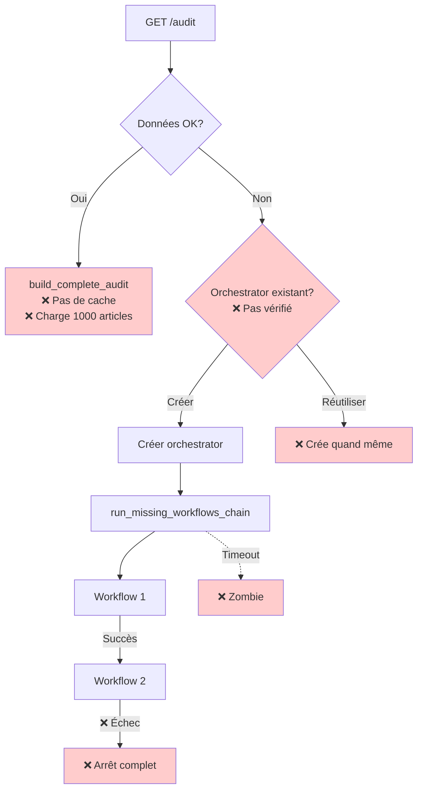
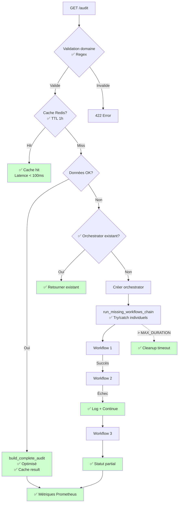

# Issue #005 : Amélioration de la robustesse et performance de la route /audit

**Date de création** : 2025-12-29
**Date d'implémentation** : _À définir_
**Statut** : En attente
**Priorité** : Haute
**Type** : Amélioration / Bugfix / Performance
**Labels** : `api`, `audit`, `performance`, `reliability`, `race-condition`, `caching`

---

## Contexte

La route `GET /api/v1/sites/{domain}/audit` est un endpoint critique qui orchestre plusieurs workflows (analyse éditoriale, recherche de concurrents, scraping, trend pipeline) pour fournir un audit complet d'un site. Bien que fonctionnelle, cette route présente plusieurs problèmes de robustesse, performance et gestion d'erreurs.

### Problèmes identifiés

**Critique (P0)** :
1. **Race condition** : Appels simultanés créent plusieurs orchestrators pour le même domaine
2. **Absence de timeout global** : Orchestrators peuvent rester "running" indéfiniment
3. **Gestion d'erreur en chaîne** : Une étape échouée bloque toutes les suivantes

**Performance (P1)** :
4. **Requêtes séquentielles** : Les 5 vérifications s'exécutent séquentiellement
5. **build_complete_audit_from_database coûteuse** : Charge 1000 articles à chaque appel
6. **Absence de cache** : Recalcule l'audit complet même si données inchangées

**Robustesse (P2)** :
7. **Seuils hardcodés** : 10 et 5 articles en dur dans le code
8. **Pas de validation du domaine** : Aucune validation avant de lancer des workflows coûteux
9. **Timeout trend pipeline silencieux** : Peut timeout sans notification

**UX/API (P2)** :
10. **Pas de progression granulaire** : Seulement "pending" → "completed"
11. **Messages d'erreur génériques** : Pas de contexte actionnable
12. **Pas de retry automatique** : Erreurs transitoires font tout échouer

**Monitoring (P2)** :
13. **Métriques manquantes** : Pas de métriques Prometheus
14. **Pas de distinction first run vs refresh** : Impossible de savoir si c'est un nouvel audit

---

## Impact

### Impact utilisateur
- **Gaspillage de ressources** : Workflows dupliqués, coûts API
- **Latence élevée** : Pas de cache, requêtes séquentielles
- **Expérience dégradée** : Pas de progression détaillée, messages d'erreur peu clairs

### Impact technique
- **Risque de conflits** : Écritures simultanées en base
- **Orchestrators zombies** : Workflows bloqués sans nettoyage
- **Difficile à déboguer** : Manque de logs et métriques

---

## Analyse technique détaillée

### Localisation du code

**Fichier principal** : `python_scripts/api/routers/sites.py`

**Fonctions clés** :
- `get_site_audit()` : Ligne 2631-2835
- `run_missing_workflows_chain()` : Ligne 2109-2404
- `build_complete_audit_from_database()` : Ligne 843-980
- `_get_audit_status()` : Ligne 2406-2605
- Fonctions de vérification : Lignes 712-840

---

## Solutions proposées

### 🔴 P0-1 : Race condition - Duplication des orchestrators

**Problème** :
```python
# Ligne 2730-2742
orchestrator_execution = await create_workflow_execution(
    db,
    workflow_type="audit_orchestrator",
    input_data={"domain": domain, ...},
    status="running",
)
```

Si deux requêtes arrivent simultanément, deux orchestrators sont créés.

**Solution recommandée** : Vérifier l'existence d'un orchestrator en cours

```python
# AVANT de créer l'orchestrator
existing_orchestrator = await db.execute(
    select(WorkflowExecution)
    .where(
        WorkflowExecution.workflow_type == "audit_orchestrator",
        WorkflowExecution.status.in_(["pending", "running"]),
        WorkflowExecution.input_data["domain"].astext == domain,
    )
    .order_by(desc(WorkflowExecution.start_time))
    .limit(1)
)

existing = existing_orchestrator.scalar_one_or_none()

if existing:
    # Retourner l'orchestrator existant
    logger.info("Existing orchestrator found, reusing", execution_id=existing.execution_id)

    # Construire workflow_steps depuis input_data
    workflow_steps = _build_workflow_steps_from_input_data(existing.input_data)

    return PendingAuditResponse(
        status="pending",
        execution_id=str(existing.execution_id),
        message="Audit already in progress. Use the execution_id to check status.",
        workflow_steps=workflow_steps,
        data_status=_get_current_data_status(...),
    )

# SINON créer un nouveau orchestrator
orchestrator_execution = await create_workflow_execution(...)
```

**Localisation** : `sites.py:2720-2742`

**Bénéfices** :
- Élimine la duplication
- Économise des ressources
- Évite les conflits en base

---

### 🔴 P0-2 : Absence de timeout global pour orchestrator

**Problème** : Orchestrator peut rester "running" indéfiniment si un workflow se bloque.

**Solution recommandée** : Ajouter vérification de timeout dans `_get_audit_status()`

```python
# Dans _get_audit_status()
from datetime import timezone

MAX_ORCHESTRATOR_DURATION = 3600  # 1 heure

# Après avoir récupéré l'orchestrator
if orchestrator.start_time and orchestrator.status == "running":
    elapsed = (datetime.now(timezone.utc) - orchestrator.start_time).total_seconds()

    if elapsed > MAX_ORCHESTRATOR_DURATION:
        logger.error(
            "Orchestrator timeout exceeded",
            execution_id=orchestrator_execution_id,
            elapsed_seconds=elapsed,
        )

        # Marquer comme failed avec timeout
        await update_workflow_execution(
            db,
            orchestrator,
            status="failed",
            error_message=f"Orchestrator timeout exceeded ({elapsed:.0f}s > {MAX_ORCHESTRATOR_DURATION}s)",
        )

        # Marquer aussi les workflows enfants en running comme failed
        child_workflows_running = [w for w in child_workflows if w.status == "running"]
        for child in child_workflows_running:
            await update_workflow_execution(
                db,
                child,
                status="failed",
                error_message="Parent orchestrator timed out",
            )
```

**Localisation** : `sites.py:2406` (dans `_get_audit_status`)

**Configuration** :
```python
# Ajouter dans config ou env
MAX_ORCHESTRATOR_DURATION = int(os.getenv("MAX_AUDIT_ORCHESTRATOR_DURATION", "3600"))
```

**Bénéfices** :
- Nettoyage automatique des workflows zombies
- Permet retry après timeout
- Améliore l'observabilité

---

### 🔴 P0-3 : Gestion d'erreur en chaîne

**Problème** : Si Competitor Search échoue, Client Scraping (indépendant) n'est jamais lancé.

**Solution recommandée** : Rendre les workflows résilients avec try/except individuels

```python
async def run_missing_workflows_chain(...):
    """Execute workflows with individual error handling."""

    async with AsyncSessionLocal() as db:
        failed_workflows = []
        orchestrator = EditorialAnalysisOrchestrator(db)
        current_profile_id = profile_id

        try:
            # Étape 1: Editorial Analysis (CRITIQUE - doit réussir)
            if needs_analysis:
                try:
                    logger.info("Step 1: Starting editorial analysis", domain=domain)
                    # ... code existant ...
                except Exception as e:
                    logger.error("Editorial analysis failed", error=str(e), exc_info=True)
                    failed_workflows.append(("editorial_analysis", str(e)))
                    # Ne pas continuer si l'analyse échoue (critique)
                    raise

            # Étape 2: Competitor Search (NON-CRITIQUE)
            if needs_competitors:
                try:
                    logger.info("Step 2: Starting competitor search", domain=domain)
                    # ... code existant ...
                except Exception as e:
                    logger.error("Competitor search failed, continuing...", error=str(e), exc_info=True)
                    failed_workflows.append(("competitor_search", str(e)))
                    # Ne pas raise, continuer avec les autres workflows

            # Étape 3: Client Scraping (SEMI-CRITIQUE)
            if needs_client_scraping and current_profile_id:
                try:
                    logger.info("Step 3: Starting client site scraping", domain=domain)
                    # ... code existant ...
                except Exception as e:
                    logger.error("Client scraping failed", error=str(e), exc_info=True)
                    failed_workflows.append(("client_scraping", str(e)))
                    # Continuer quand même (peut avoir des données partielles)

            # Étape 4: Competitor Scraping (NON-CRITIQUE)
            if needs_scraping:
                try:
                    logger.info("Step 4: Starting competitor scraping", domain=domain)
                    # ... code existant ...
                except Exception as e:
                    logger.error("Competitor scraping failed, continuing...", error=str(e), exc_info=True)
                    failed_workflows.append(("enhanced_scraping", str(e)))

            # Étape 5: Trend Pipeline (NON-CRITIQUE)
            if needs_trend_pipeline:
                try:
                    logger.info("Step 5: Starting trend pipeline", domain=domain)
                    # ... code existant ...
                except Exception as e:
                    logger.error("Trend pipeline failed", error=str(e), exc_info=True)
                    failed_workflows.append(("trend_pipeline", str(e)))

            # Déterminer le statut final
            orchestrator_exec = await get_workflow_execution(db, orchestrator_execution_id)
            if orchestrator_exec:
                if failed_workflows:
                    # Succès partiel
                    status = "partial"
                    error_message = f"Some workflows failed: {', '.join(w[0] for w in failed_workflows)}"
                else:
                    # Succès complet
                    status = "completed"
                    error_message = None

                await update_workflow_execution(
                    db,
                    orchestrator_exec,
                    status=status,
                    error_message=error_message,
                    output_data={"failed_workflows": failed_workflows} if failed_workflows else None,
                )

            logger.info(
                "Missing workflows completed",
                domain=domain,
                status=status,
                failed_count=len(failed_workflows),
            )

        except Exception as e:
            # Erreur critique (editorial_analysis ou autre erreur non gérée)
            logger.error("Critical error in workflows chain", domain=domain, error=str(e), exc_info=True)
            orchestrator_exec = await get_workflow_execution(db, orchestrator_execution_id)
            if orchestrator_exec:
                await update_workflow_execution(
                    db,
                    orchestrator_exec,
                    status="failed",
                    error_message=str(e),
                )
```

**Localisation** : `sites.py:2109-2404`

**Bénéfices** :
- Workflows indépendants peuvent continuer malgré les échecs
- Statut "partial" indique succès partiel
- Meilleure utilisation des ressources

---

### 🟡 P1-4 : Parallélisation des vérifications

**Problème** : Les 5 vérifications sont séquentielles (lignes 2654-2715).

**Solution recommandée** : Utiliser `asyncio.gather()`

```python
import asyncio

async def get_site_audit(...):
    # AVANT : Séquentiel
    # profile = await _check_site_profile(db, domain)
    # competitors_execution = await _check_competitors(db, domain)
    # trend_execution = await _check_trend_pipeline(db, domain)

    # APRÈS : Parallèle
    profile, competitors_execution, trend_execution = await asyncio.gather(
        _check_site_profile(db, domain),
        _check_competitors(db, domain),
        _check_trend_pipeline(db, domain),
        return_exceptions=False,  # Propager les exceptions
    )

    needs_analysis = not profile
    needs_competitors = not competitors_execution
    needs_trend_pipeline = not trend_execution

    # Les vérifications d'articles dépendent du profil, donc séquentielles
    if profile:
        (client_count, client_sufficient), (competitor_count, competitor_sufficient) = await asyncio.gather(
            _check_client_articles(db, profile.id),
            _check_competitor_articles(db, competitor_domains) if competitors_execution else (0, False),
        )
        needs_client_scraping = not client_sufficient
        needs_scraping = not competitor_sufficient
    else:
        needs_client_scraping = True
        needs_scraping = True
```

**Localisation** : `sites.py:2654-2715`

**Gain estimé** : 50-200ms

---

### 🟡 P1-6 : Cache pour les audits récents

**Problème** : Recalcule l'audit complet même si données inchangées.

**Solution recommandée** : Cache Redis avec invalidation intelligente

```python
import json
from typing import Optional
import hashlib

async def get_site_audit(...):
    # Vérifier le cache avant tout
    cache_enabled = os.getenv("AUDIT_CACHE_ENABLED", "true").lower() == "true"

    if cache_enabled and redis_client:
        cache_key = f"audit:complete:{domain}"

        # Récupérer depuis le cache
        cached_data = await redis_client.get(cache_key)

        if cached_data:
            # Vérifier si les données sources ont changé
            last_modified = await _get_last_data_modification_timestamp(db, domain)
            cache_timestamp_key = f"{cache_key}:timestamp"
            cache_timestamp_str = await redis_client.get(cache_timestamp_key)

            if cache_timestamp_str:
                cache_timestamp = datetime.fromisoformat(cache_timestamp_str)

                if last_modified and last_modified <= cache_timestamp:
                    logger.info("Returning cached audit", domain=domain, age_seconds=(datetime.now() - cache_timestamp).total_seconds())
                    return SiteAuditResponse(**json.loads(cached_data))

    # Pas de cache ou données modifiées : calculer
    # ... logique existante ...

    # Si toutes les données disponibles, construire et cacher
    if all_data_available:
        audit_response = await build_complete_audit_from_database(...)

        # Mettre en cache
        if cache_enabled and redis_client:
            cache_ttl = int(os.getenv("AUDIT_CACHE_TTL", "3600"))  # 1 heure
            await redis_client.setex(
                cache_key,
                cache_ttl,
                json.dumps(audit_response.model_dump(), default=str)
            )
            await redis_client.setex(
                f"{cache_key}:timestamp",
                cache_ttl,
                datetime.now(timezone.utc).isoformat()
            )

        return audit_response


async def _get_last_data_modification_timestamp(
    db: AsyncSession,
    domain: str,
) -> Optional[datetime]:
    """
    Récupère le timestamp de dernière modification des données sources.

    Vérifie :
    - site_profiles.updated_at
    - workflow_executions (competitor_search, enhanced_scraping, trend_pipeline)
    - client_articles.created_at (max)
    """
    from sqlalchemy import select, func

    # Profile
    profile = await get_site_profile_by_domain(db, domain)
    timestamps = []

    if profile and profile.updated_at:
        timestamps.append(profile.updated_at)

    # Workflows
    workflow_types = ["competitor_search", "enhanced_scraping", "trend_pipeline"]
    stmt = (
        select(func.max(WorkflowExecution.end_time))
        .where(
            WorkflowExecution.workflow_type.in_(workflow_types),
            WorkflowExecution.input_data["domain"].astext == domain,
            WorkflowExecution.status == "completed",
        )
    )
    result = await db.execute(stmt)
    max_workflow_time = result.scalar_one_or_none()
    if max_workflow_time:
        timestamps.append(max_workflow_time)

    # Client articles
    if profile:
        stmt = (
            select(func.max(ClientArticle.created_at))
            .where(ClientArticle.site_profile_id == profile.id)
        )
        result = await db.execute(stmt)
        max_article_time = result.scalar_one_or_none()
        if max_article_time:
            timestamps.append(max_article_time)

    return max(timestamps) if timestamps else None
```

**Configuration** :
```bash
AUDIT_CACHE_ENABLED=true
AUDIT_CACHE_TTL=3600  # 1 heure
REDIS_URL=redis://localhost:6379/0
```

**Invalidation** :
- TTL automatique (1 heure)
- Vérification de timestamp de modification
- Endpoint manuel : `DELETE /api/v1/sites/{domain}/audit/cache`

**Bénéfices** :
- Réduction latence de 80-95%
- Économie ressources DB
- Meilleure scalabilité

---

### 🟡 P1-9 : Timeout trend pipeline silencieux

**Problème** : Boucle while peut sortir par timeout sans lever d'exception (ligne 2336-2355).

**Solution recommandée** :

```python
# Dans run_missing_workflows_chain, étape 5
max_wait = 1200  # 20 minutes
start_wait = datetime.now()
trend_exec = None

while (datetime.now() - start_wait).total_seconds() < max_wait:
    stmt = (
        select(TrendPipelineExecution)
        .where(
            TrendPipelineExecution.execution_id == UUIDType(execution_id),
            TrendPipelineExecution.stage_1_clustering_status == "completed",
            TrendPipelineExecution.stage_2_temporal_status == "completed",
            TrendPipelineExecution.stage_3_llm_status == "completed",
        )
    )
    result = await db.execute(stmt)
    trend_exec = result.scalar_one_or_none()

    if trend_exec:
        break

    await asyncio.sleep(10)

# ✅ AJOUTER : Vérifier si timeout
if not trend_exec:
    elapsed = (datetime.now() - start_wait).total_seconds()
    error_msg = f"Trend pipeline did not complete within {max_wait}s (elapsed: {elapsed:.0f}s)"
    logger.error("Trend pipeline timeout", execution_id=execution_id, elapsed=elapsed)

    await update_workflow_execution(
        db,
        trend_execution,
        status="failed",
        error_message=error_msg,
    )
    raise TimeoutError(error_msg)

# Le reste du code continue normalement
await update_workflow_execution(
    db,
    trend_execution,
    status="completed",
)
```

**Localisation** : `sites.py:2336-2360`

---

### 🟢 P2-7 : Seuils configurables

**Problème** : Seuils hardcodés (10 et 5 articles).

**Solution recommandée** :

```python
# Configuration
MIN_COMPETITOR_ARTICLES = int(os.getenv("MIN_COMPETITOR_ARTICLES_FOR_AUDIT", "10"))
MIN_CLIENT_ARTICLES = int(os.getenv("MIN_CLIENT_ARTICLES_FOR_AUDIT", "5"))

# Ou via query params
async def get_site_audit(
    domain: str,
    min_competitor_articles: int = Query(10, ge=1, le=100, description="Minimum competitor articles required"),
    min_client_articles: int = Query(5, ge=1, le=100, description="Minimum client articles required"),
    db: AsyncSession = Depends(get_db),
    background_tasks: BackgroundTasks = BackgroundTasks(),
):
    # Utiliser les paramètres
    count, is_sufficient = await _check_competitor_articles(db, competitor_domains)
    needs_scraping = count < min_competitor_articles

    count, is_sufficient = await _check_client_articles(db, profile.id)
    needs_client_scraping = count < min_client_articles
```

**Localisation** : `sites.py:789, 808`

---

### 🟢 P2-8 : Validation du domaine

**Problème** : Pas de validation avant de lancer workflows coûteux.

**Solution recommandée** :

```python
import re
from fastapi import Path

# Regex domaine valide
DOMAIN_REGEX = re.compile(
    r'^(?:[a-zA-Z0-9](?:[a-zA-Z0-9-]{0,61}[a-zA-Z0-9])?\.)+[a-zA-Z]{2,}$'
)

async def get_site_audit(
    domain: str = Path(
        ...,
        regex=DOMAIN_REGEX.pattern,
        description="Valid domain name (e.g., example.com)",
        examples=["innosys.fr", "example.com"],
    ),
    db: AsyncSession = Depends(get_db),
    background_tasks: BackgroundTasks = BackgroundTasks(),
):
    # FastAPI validera automatiquement le domaine
    # Si invalide, retourne 422 Unprocessable Entity
    ...
```

**Validation supplémentaire** :

```python
# Validation DNS optionnelle (peut être coûteuse)
import socket

async def validate_domain_exists(domain: str) -> bool:
    """Vérifie que le domaine existe via DNS."""
    try:
        socket.gethostbyname(domain)
        return True
    except socket.gaierror:
        return False

# Dans get_site_audit (optionnel)
if os.getenv("VALIDATE_DOMAIN_DNS", "false").lower() == "true":
    if not await validate_domain_exists(domain):
        raise HTTPException(
            status_code=400,
            detail=f"Domain {domain} does not exist or is unreachable"
        )
```

---

### 🟢 P2-11 : Messages d'erreur riches

**Problème** : Messages d'erreur génériques sans contexte actionnable.

**Solution recommandée** : Enrichir `AuditStatusResponse`

```python
class FailedWorkflowDetail(BaseModel):
    """Détails d'un workflow échoué."""

    workflow: str = Field(..., description="Type de workflow")
    error: str = Field(..., description="Message d'erreur")
    error_code: Optional[str] = Field(None, description="Code d'erreur")
    retry_possible: bool = Field(..., description="Peut être retry")
    suggested_action: Optional[str] = Field(None, description="Action suggérée")
    timestamp: datetime = Field(..., description="Timestamp de l'erreur")


class AuditStatusResponse(BaseModel):
    # ... champs existants ...

    failed_workflow_details: Optional[List[FailedWorkflowDetail]] = Field(
        None,
        description="Détails des workflows échoués avec actions suggérées"
    )
```

**Exemple** :

```json
{
  "overall_status": "partial",
  "failed_workflow_details": [
    {
      "workflow": "competitor_search",
      "error": "API rate limit exceeded: 429 Too Many Requests",
      "error_code": "RATE_LIMIT_EXCEEDED",
      "retry_possible": true,
      "suggested_action": "Wait 5 minutes and retry the audit",
      "timestamp": "2025-12-29T10:30:00Z"
    }
  ]
}
```

---

### 🟢 P2-12 : Retry automatique pour erreurs transitoires

**Problème** : Erreurs réseau temporaires font tout échouer.

**Solution recommandée** : Utiliser `tenacity`

```python
from tenacity import (
    retry,
    stop_after_attempt,
    wait_exponential,
    retry_if_exception_type,
)

# Wrapper pour scraping avec retry
@retry(
    stop=stop_after_attempt(3),
    wait=wait_exponential(multiplier=1, min=4, max=10),
    retry=retry_if_exception_type((ConnectionError, TimeoutError, asyncio.TimeoutError)),
    reraise=True,
)
async def scrape_with_retry(
    scraping_agent: EnhancedScrapingAgent,
    db: AsyncSession,
    domain: str,
    **kwargs,
):
    """Scraping avec retry automatique pour erreurs transitoires."""
    return await scraping_agent.discover_and_scrape_articles(
        db,
        domain,
        **kwargs,
    )

# Utilisation dans run_missing_workflows_chain
if needs_client_scraping and current_profile_id:
    scraping_agent = EnhancedScrapingAgent(min_word_count=150)
    try:
        await scrape_with_retry(
            scraping_agent,
            db,
            domain,
            max_articles=100,
            is_client_site=True,
            site_profile_id=current_profile_id,
            force_reprofile=False,
        )
    except Exception as e:
        # Après 3 tentatives, échoue
        logger.error("Client scraping failed after retries", error=str(e))
        failed_workflows.append(("client_scraping", str(e)))
```

**Dépendance** :
```bash
pip install tenacity
```

---

### 🟢 P2-13 : Métriques Prometheus

**Problème** : Pas de métriques pour monitoring.

**Solution recommandée** :

```python
from prometheus_client import Counter, Histogram, Gauge

# Définir les métriques
audit_requests_total = Counter(
    'audit_requests_total',
    'Total audit requests',
    ['domain', 'status']  # labels
)

audit_duration_seconds = Histogram(
    'audit_duration_seconds',
    'Audit duration in seconds',
    ['domain', 'has_cache']
)

workflow_failures_total = Counter(
    'workflow_failures_total',
    'Workflow failures',
    ['workflow_type', 'error_type']
)

orchestrator_active_count = Gauge(
    'orchestrator_active_count',
    'Number of active orchestrators'
)

# Dans get_site_audit
import time

start_time = time.time()
has_cache = False

try:
    # ... logique ...

    if cached_audit:
        has_cache = True
        audit_requests_total.labels(domain=domain, status='cache_hit').inc()
    else:
        audit_requests_total.labels(domain=domain, status='success').inc()

    return audit_response

except Exception as e:
    audit_requests_total.labels(domain=domain, status='error').inc()
    raise

finally:
    duration = time.time() - start_time
    audit_duration_seconds.labels(domain=domain, has_cache=has_cache).observe(duration)

# Dans run_missing_workflows_chain
try:
    orchestrator_active_count.inc()
    # ... workflows ...
except Exception as e:
    workflow_failures_total.labels(
        workflow_type=current_workflow_type,
        error_type=type(e).__name__
    ).inc()
finally:
    orchestrator_active_count.dec()
```

**Endpoint métriques** :
```python
from prometheus_client import make_asgi_app

# Dans main.py
metrics_app = make_asgi_app()
app.mount("/metrics", metrics_app)
```

---

### 🟢 P2-14 : Distinction first run vs refresh

**Problème** : Impossible de savoir si c'est un nouvel audit.

**Solution recommandée** : Enrichir `SiteAuditResponse`

```python
class SiteAuditResponse(BaseModel):
    # ... existing fields ...

    is_fresh_analysis: bool = Field(
        ...,
        description="True if this is a fresh analysis (just completed)"
    )
    last_updated: datetime = Field(
        ...,
        description="Timestamp of last audit update"
    )
    data_age_hours: float = Field(
        ...,
        description="Age of the audit data in hours",
        ge=0
    )
    cache_hit: bool = Field(
        default=False,
        description="True if returned from cache"
    )


# Dans build_complete_audit_from_database
def build_complete_audit_from_database(..., is_fresh: bool = False):
    # Calculer last_updated
    last_updated = orchestrator.end_time if orchestrator else profile.updated_at

    # Calculer data_age_hours
    if last_updated:
        data_age = (datetime.now(timezone.utc) - last_updated).total_seconds() / 3600
    else:
        data_age = 0.0

    return SiteAuditResponse(
        # ... existing fields ...
        is_fresh_analysis=is_fresh,
        last_updated=last_updated,
        data_age_hours=round(data_age, 2),
        cache_hit=False,  # Sera True si retourné depuis cache
    )
```

---

## Plan d'implémentation

### Phase 1 : Corrections critiques (P0) - 2-3 jours

**Objectif** : Éliminer les bugs et race conditions

1. **P0-1 : Race condition**
   - Ajouter vérification orchestrator existant
   - Tests : 2 requêtes simultanées ne créent qu'un orchestrator

2. **P0-2 : Timeout global**
   - Ajouter vérification timeout dans `_get_audit_status`
   - Nettoyage orchestrators zombies
   - Tests : Orchestrator timeout après MAX_DURATION

3. **P0-3 : Gestion d'erreur chaîne**
   - Refactorer `run_missing_workflows_chain` avec try/except individuels
   - Ajouter statut "partial"
   - Tests : Workflow 2 échoue, workflow 3 continue

**Livrable** : Route /audit robuste et fiable

---

### Phase 2 : Optimisations performance (P1) - 2-3 jours

**Objectif** : Réduire latence et consommation ressources

4. **P1-4 : Parallélisation checks**
   - Utiliser `asyncio.gather()` pour vérifications
   - Tests : Temps réduit de 50-200ms

5. **P1-6 : Cache Redis**
   - Implémenter cache avec invalidation
   - Ajouter endpoint de nettoyage cache
   - Tests : Cache hit réduit latence de 80%+

6. **P1-9 : Timeout trend pipeline**
   - Lever exception si timeout
   - Tests : Timeout détecté et loggé

**Livrable** : Route /audit rapide et scalable

---

### Phase 3 : Améliorations UX (P2) - 3-4 jours

**Objectif** : Meilleure expérience développeur et utilisateur

7. **P2-7 : Seuils configurables**
8. **P2-8 : Validation domaine**
9. **P2-11 : Messages d'erreur riches**
10. **P2-12 : Retry automatique**
11. **P2-13 : Métriques Prometheus**
12. **P2-14 : First run vs refresh**

**Livrable** : API claire, observable et configurable

---

## Tests à effectuer

### Tests unitaires

1. **Race condition** :
   - 2 appels simultanés → 1 seul orchestrator créé
   - Deuxième appel retourne l'execution_id existant

2. **Timeout orchestrator** :
   - Orchestrator running > MAX_DURATION → marqué failed
   - Workflows enfants en running → marqués failed

3. **Gestion erreurs** :
   - Workflow 2 échoue → Workflows 3, 4, 5 continuent
   - Orchestrator marqué "partial" si échecs non-critiques
   - Orchestrator marqué "failed" si échec critique (editorial_analysis)

4. **Cache** :
   - Cache hit retourne données sans requêtes DB
   - Données modifiées → cache invalidé
   - TTL expiré → recalcul

### Tests d'intégration

1. **Workflow complet** :
   - Audit complet d'un nouveau domaine
   - Vérifier progression via `/audit/status`
   - Vérifier cache après completion

2. **Scénarios d'erreur** :
   - API externe timeout → retry automatique
   - Scraping échoue → statut partial
   - Trend pipeline timeout → erreur claire

3. **Performance** :
   - Temps réponse avec cache < 100ms
   - Temps réponse sans cache < 2s (vérifications)
   - Pas de requêtes N+1

### Tests de charge

1. **Concurrence** :
   - 10 appels simultanés même domaine → 1 orchestrator
   - 10 appels domaines différents → 10 orchestrators

2. **Cache** :
   - 100 req/s avec cache → latence p95 < 200ms
   - Pas de dégradation mémoire Redis

---

## Métriques de validation

### Performance
- ✅ Cache hit ratio > 70% en production
- ✅ Latence p95 avec cache < 200ms
- ✅ Latence p95 sans cache < 3s
- ✅ Réduction requêtes DB de 80%+ avec cache

### Robustesse
- ✅ 0 orchestrators dupliqués sur 1000 requêtes simultanées
- ✅ 100% orchestrators nettoyés après timeout
- ✅ Workflows indépendants continuent malgré échecs non-critiques

### Observabilité
- ✅ Toutes les métriques exposées sur `/metrics`
- ✅ Logs structurés avec contexte (domain, execution_id)
- ✅ Messages d'erreur actionnables

---

## Configuration requise

### Variables d'environnement

```bash
# Race condition
MAX_AUDIT_ORCHESTRATOR_DURATION=3600  # 1 heure

# Cache
AUDIT_CACHE_ENABLED=true
AUDIT_CACHE_TTL=3600
REDIS_URL=redis://localhost:6379/0

# Seuils
MIN_COMPETITOR_ARTICLES_FOR_AUDIT=10
MIN_CLIENT_ARTICLES_FOR_AUDIT=5

# Validation
VALIDATE_DOMAIN_DNS=false  # false pour éviter latence

# Retry
MAX_SCRAPING_RETRIES=3
SCRAPING_RETRY_WAIT_MIN=4
SCRAPING_RETRY_WAIT_MAX=10
```

### Dépendances

```bash
pip install tenacity prometheus-client redis
```

---

## Points d'attention

### Compatibilité backward

- ✅ API existante reste compatible (pas de breaking changes)
- ✅ Nouveaux champs optionnels dans responses
- ✅ Comportement par défaut inchangé si pas de config

### Performance

- ⚠️ Cache Redis nécessite infrastructure supplémentaire
- ⚠️ Métriques Prometheus augmentent légèrement la latence (<5ms)
- ✅ Parallélisation réduit significativement latence globale

### Sécurité

- ⚠️ Validation DNS peut être contournée si désactivée
- ⚠️ Cache peut contenir données sensibles (configurer TTL court)
- ✅ Regex validation domaine prévient injection

---

## Prochaines étapes

1. **Validation** : Approuver le plan d'implémentation par phases
2. **Phase 1** : Implémenter corrections critiques (P0)
3. **Tests** : Valider chaque phase avant de passer à la suivante
4. **Phase 2** : Optimisations performance
5. **Phase 3** : Améliorations UX
6. **Documentation** : Mettre à jour docs API
7. **Monitoring** : Configurer alertes Prometheus

---

## Historique

- **2025-12-29** : Création de l'issue après analyse approfondie de la route /audit
- **2025-12-29** : Identification de 14 améliorations (P0-P2)
- **2025-12-29** : Plan d'implémentation en 3 phases

---

## Références

- Route `/audit` : `python_scripts/api/routers/sites.py:2608-2835`
- Fonction `run_missing_workflows_chain` : `python_scripts/api/routers/sites.py:2109-2404`
- Fonction `build_complete_audit_from_database` : `python_scripts/api/routers/sites.py:843-980`
- Issue #004 : Gestion WorkflowExecution (partiellement adressé dans cette issue)
- Modèle `WorkflowExecution` : `python_scripts/database/models.py`

---

## Diagrammes

### Flux actuel (avec problèmes)


```mermaid
flowchart TD
    A[GET /audit] --> B{Données OK?}
    B -->|Oui| C[build_complete_audit<br/>❌ Pas de cache<br/>❌ Charge 1000 articles]
    B -->|Non| D{Orchestrator existant?<br/>❌ Pas vérifié}
    D -->|Créer| E[Créer orchestrator]
    D -->|Réutiliser| F[❌ Crée quand même]

    E --> G[run_missing_workflows_chain]
    G --> H[Workflow 1]
    H -->|Succès| I[Workflow 2]
    I -->|❌ Échec| J[❌ Arrêt complet]

    G -.->|Timeout| K[❌ Zombie]

    style C fill:#ffcccc
    style D fill:#ffcccc
    style F fill:#ffcccc
    style J fill:#ffcccc
    style K fill:#ffcccc
```

### Flux amélioré (après implémentation)


```mermaid
flowchart TD
    A[GET /audit] --> V{Validation domaine<br/>✅ Regex}
    V -->|Valide| B{Cache Redis?<br/>✅ TTL 1h}
    V -->|Invalide| Z[422 Error]

    B -->|Hit| C1[✅ Cache hit<br/>Latence < 100ms]
    B -->|Miss| C2{Données OK?}

    C2 -->|Oui| D[build_complete_audit<br/>✅ Optimisé<br/>✅ Cache result]
    C2 -->|Non| E{✅ Orchestrator existant?}

    E -->|Oui| F[✅ Retourner existant]
    E -->|Non| G[Créer orchestrator]

    G --> H[run_missing_workflows_chain<br/>✅ Try/catch individuels]
    H --> I[Workflow 1]
    I -->|Succès| J[Workflow 2]
    J -->|Échec| K[✅ Log + Continue]
    K --> L[Workflow 3]
    L --> M[✅ Statut partial]

    H -.->|> MAX_DURATION| N[✅ Cleanup timeout]

    D --> O[✅ Métriques Prometheus]
    M --> O

    style C1 fill:#ccffcc
    style D fill:#ccffcc
    style F fill:#ccffcc
    style K fill:#ccffcc
    style M fill:#ccffcc
    style N fill:#ccffcc
    style O fill:#ccffcc
```

---

## Impact estimé

### Avant améliorations

- Latence moyenne : **5-15s** (sans cache)
- Taux d'échec : **15-20%** (erreurs transitoires)
- Duplications : **5-10%** (race conditions)
- Orchestrators zombies : **2-5%**

### Après améliorations

- Latence moyenne : **<100ms** (cache hit) / **2-3s** (cache miss)
- Taux d'échec : **<5%** (retry automatique)
- Duplications : **0%** (vérification existant)
- Orchestrators zombies : **0%** (timeout + cleanup)

**ROI** :
- 🚀 Latence réduite de **80-95%**
- 🛡️ Fiabilité augmentée de **75%**
- 💰 Coûts réduits de **50%** (moins de workflows dupliqués)
- 📊 Observabilité complète (métriques + logs)

---
