# Diagramme de Cas d'Utilisation - Route POST /api/v1/sites/analyze

## Vue d'ensemble

Ce document présente les cas d'utilisation (Use Cases) de la route `POST /api/v1/sites/analyze` avec un diagramme UML et une description détaillée de chaque cas d'utilisation.

## Diagramme de Cas d'Utilisation

```mermaid
graph TB
    subgraph "Acteurs Externes"
        CLIENT[👤 Client<br/>Utilisateur/Application]
        TARGET[🌐 Site Web Cible<br/>Target Website]
        OLLAMA[🤖 Ollama<br/>LLM Server]
        QDRANT[💾 Qdrant<br/>Vector Store]
    end
    
    subgraph "Système - API Editorial"
        API[📡 API Router<br/>/api/v1/sites/analyze]
        ORCH[🎯 Orchestrator<br/>EditorialAnalysisOrchestrator]
        AGENT_ANALYSIS[🧠 Analysis Agent<br/>Multi-LLM]
        AGENT_SCRAPE[📥 Scraping Agent<br/>Enhanced]
        SITEMAP[🗺️ Sitemap Discovery]
        CRAWLER[🕷️ Page Crawler]
    end
    
    subgraph "Cas d'Utilisation Principaux"
        UC1[UC1: Lancer Analyse<br/>Éditoriale]
        UC2[UC2: Découvrir URLs<br/>via Sitemap]
        UC3[UC3: Crawler Pages<br/>Web]
        UC4[UC4: Analyser Contenu<br/>Multi-LLM]
        UC5[UC5: Créer/Mettre à jour<br/>Profil Éditorial]
        UC6[UC6: Scraper Site Client<br/>Automatiquement]
        UC7[UC7: Gérer Erreurs<br/>et Exceptions]
        UC8[UC8: Suivre Progression<br/>Execution]
    end
    
    subgraph "Cas d'Utilisation Secondaires"
        UC2A[UC2.1: Parser Sitemap<br/>XML]
        UC2B[UC2.2: Fallback<br/>Homepage]
        UC3A[UC3.1: Vérifier<br/>robots.txt]
        UC3B[UC3.2: Extraire<br/>Contenu HTML]
        UC4A[UC4.1: Analyser avec<br/>Llama3]
        UC4B[UC4.2: Analyser avec<br/>Mistral]
        UC4C[UC4.3: Analyser avec<br/>Phi3]
        UC4D[UC4.4: Synthétiser<br/>Résultats]
        UC6A[UC6.1: Découvrir Articles<br/>Multi-sources]
        UC6B[UC6.2: Scorer URLs<br/>Probabilité]
        UC6C[UC6.3: Extraire Articles<br/>Adaptatif]
        UC6D[UC6.4: Indexer dans<br/>Qdrant]
    end
    
    CLIENT -->|1. POST request| UC1
    UC1 -->|2. Déclenche| API
    API -->|3. Orchestre| ORCH
    
    ORCH -->|4.1| UC2
    UC2 -->|4.1.1| UC2A
    UC2 -->|4.1.2| UC2B
    UC2 -->|4.1.3| SITEMAP
    SITEMAP -->|Fetch| TARGET
    
    ORCH -->|4.2| UC3
    UC3 -->|4.2.1| UC3A
    UC3 -->|4.2.2| UC3B
    UC3 -->|4.2.3| CRAWLER
    CRAWLER -->|Fetch| TARGET
    
    ORCH -->|4.3| UC4
    UC4 -->|4.3.1| UC4A
    UC4 -->|4.3.2| UC4B
    UC4 -->|4.3.3| UC4C
    UC4 -->|4.3.4| UC4D
    UC4 -->|Utilise| AGENT_ANALYSIS
    AGENT_ANALYSIS -->|Appelle| OLLAMA
    
    ORCH -->|4.4| UC5
    UC5 -->|Persiste| API
    
    ORCH -->|4.5| UC6
    UC6 -->|5.1| UC6A
    UC6 -->|5.2| UC6B
    UC6 -->|5.3| UC6C
    UC6 -->|5.4| UC6D
    UC6 -->|Utilise| AGENT_SCRAPE
    UC6D -->|Indexe| QDRANT
    
    UC1 -.->|En cas d'erreur| UC7
    UC2 -.->|En cas d'erreur| UC7
    UC3 -.->|En cas d'erreur| UC7
    UC4 -.->|En cas d'erreur| UC7
    UC5 -.->|En cas d'erreur| UC7
    UC6 -.->|En cas d'erreur| UC7
    
    CLIENT -->|Polling| UC8
    UC8 -->|Lit| API
    
    style CLIENT fill:#4a90e2,color:#fff
    style UC1 fill:#50c878,color:#fff
    style UC4 fill:#ff6b6b,color:#fff
    style UC6 fill:#f39c12,color:#fff
    style UC7 fill:#e74c3c,color:#fff
    style OLLAMA fill:#3498db,color:#fff
    style QDRANT fill:#9b59b6,color:#fff
```

## Description Détaillée des Cas d'Utilisation

### UC1: Lancer Analyse Éditoriale

**Acteur Principal** : Client (Utilisateur/Application)

**Préconditions** :
- Le client a accès à l'API
- Le domaine cible est valide et accessible

**Flux Principal** :
1. Le client envoie une requête `POST /api/v1/sites/analyze` avec `{domain, max_pages}`
2. L'API crée un enregistrement `workflow_execution` avec status "pending"
3. L'API lance une tâche en arrière-plan
4. L'API retourne immédiatement `202 Accepted` avec `execution_id`
5. Le workflow s'exécute en arrière-plan

**Flux Alternatif 1A** : Domaine invalide
- L'API retourne `400 Bad Request` avec message d'erreur

**Flux Alternatif 1B** : Erreur serveur
- L'API retourne `500 Internal Server Error`
- L'exécution est marquée comme "failed"

**Postconditions** :
- Un `workflow_execution` est créé
- Le workflow est lancé en arrière-plan
- Le client peut suivre la progression via `execution_id`

---

### UC2: Découvrir URLs via Sitemap

**Acteur Principal** : Orchestrator

**Préconditions** :
- Le domaine est valide
- L'orchestrator est initialisé

**Flux Principal** :
1. L'orchestrator appelle `get_sitemap_urls(domain)`
2. Le système tente de découvrir le sitemap XML
3. Le système parse le sitemap et extrait les URLs
4. Les URLs sont retournées à l'orchestrator

**Flux Alternatif 2A** : Sitemap non trouvé
- Le système utilise la homepage comme fallback
- Retourne `[f"https://{domain}"]`

**Flux Alternatif 2B** : Sitemap invalide
- Le système utilise la homepage comme fallback

**Postconditions** :
- Une liste d'URLs est disponible pour le crawl
- Au moins une URL (homepage) est disponible

---

### UC3: Crawler Pages Web

**Acteur Principal** : Orchestrator

**Préconditions** :
- Une liste d'URLs est disponible
- Le crawler est initialisé

**Flux Principal** :
1. L'orchestrator appelle `crawl_multiple_pages(urls)`
2. Pour chaque URL :
   - Vérification basique de robots.txt
   - Fetch de la page via httpx
   - Extraction du contenu HTML
   - Extraction du texte brut
   - Extraction des métadonnées (titre, description)
3. Les pages crawléees sont retournées

**Flux Alternatif 3A** : Page inaccessible
- La page est marquée comme "failed"
- Le workflow continue avec les autres pages

**Flux Alternatif 3B** : Aucune page crawléee
- Le workflow échoue avec erreur "No pages crawled"

**Postconditions** :
- Une liste de pages crawléees est disponible
- Chaque page contient : HTML, texte, métadonnées

---

### UC4: Analyser Contenu Multi-LLM

**Acteur Principal** : Analysis Agent

**Préconditions** :
- Le contenu combiné est disponible
- Les modèles LLM sont accessibles (Ollama)

**Flux Principal** :
1. L'agent combine le contenu de toutes les pages
2. L'agent analyse avec **Llama3:8b** (analyse principale)
3. L'agent analyse avec **Mistral:7b** (analyse complémentaire)
4. L'agent analyse avec **Phi3:medium** (analyse détaillée)
5. L'agent synthétise les 3 analyses avec Llama3
6. Les résultats sont retournés

**Flux Alternatif 4A** : Échec d'un modèle LLM
- L'agent continue avec les autres modèles
- Utilise un merge manuel si la synthèse échoue

**Flux Alternatif 4B** : Tous les modèles échouent
- Le workflow échoue avec erreur LLM

**Postconditions** :
- Un profil éditorial complet est généré
- Contient : language_level, editorial_tone, target_audience, activity_domains, content_structure, keywords, style_features

---

### UC5: Créer/Mettre à jour Profil Éditorial

**Acteur Principal** : Orchestrator

**Préconditions** :
- Les résultats de l'analyse LLM sont disponibles
- La session base de données est active

**Flux Principal** :
1. L'orchestrator vérifie si un profil existe pour le domaine
2. Si le profil n'existe pas :
   - Création d'un nouveau `site_profile`
3. Si le profil existe :
   - Mise à jour du profil existant
4. Sauvegarde des résultats dans `site_analysis_result`
5. Mise à jour de `workflow_execution` avec status "completed"

**Flux Alternatif 5A** : Erreur de sauvegarde
- Le workflow échoue
- L'exécution est marquée comme "failed"

**Postconditions** :
- Un `site_profile` existe pour le domaine
- Un `site_analysis_result` est créé
- Le `workflow_execution` est mis à jour

---

### UC6: Scraper Site Client Automatiquement

**Acteur Principal** : Scraping Agent (Background)

**Préconditions** :
- L'analyse principale est terminée
- Le `site_profile` existe

**Flux Principal** :
1. L'orchestrator lance le scraping en arrière-plan
2. **Phase Discovery** : Découverte d'articles via API, RSS, Sitemap, Heuristiques
3. **Phase Scoring** : Calcul de probabilité pour chaque URL
4. **Phase Extraction** : Extraction adaptative du contenu
5. **Phase Validation** : Validation de la qualité du contenu
6. Sauvegarde des articles dans `client_articles`
7. Indexation dans Qdrant (collection `{domain}_client_articles`)

**Flux Alternatif 6A** : Erreur de scraping
- L'erreur est loggée
- Le workflow principal n'est pas interrompu
- Les articles déjà scrapés sont sauvegardés

**Postconditions** :
- Des articles clients sont sauvegardés (si disponibles)
- Un profil de découverte est créé/mis à jour
- Les articles sont indexés dans Qdrant

---

### UC7: Gérer Erreurs et Exceptions

**Acteur Principal** : Système (Tous les composants)

**Préconditions** :
- Une erreur survient dans le workflow

**Flux Principal** :
1. L'erreur est capturée
2. L'erreur est loggée avec contexte
3. Le `workflow_execution` est mis à jour avec :
   - `status` = "failed"
   - `error_message` = message d'erreur
   - `was_success` = false
4. L'exception est propagée si nécessaire

**Flux Alternatif 7A** : Erreur non critique (scraping)
- L'erreur est loggée
- Le workflow continue

**Postconditions** :
- L'erreur est tracée
- Le statut de l'exécution reflète l'échec

---

### UC8: Suivre Progression Execution

**Acteur Principal** : Client

**Préconditions** :
- Un `execution_id` existe
- L'exécution est en cours ou terminée

**Flux Principal** :
1. Le client fait une requête `GET /api/v1/executions/{execution_id}`
2. L'API lit le `workflow_execution` depuis la base
3. L'API retourne le statut actuel :
   - "pending" : En attente
   - "running" : En cours
   - "completed" : Terminé avec succès
   - "failed" : Échoué

**Flux Alternatif 8A** : Execution non trouvée
- L'API retourne `404 Not Found`

**Postconditions** :
- Le client connaît le statut de l'exécution
- Le client peut accéder aux résultats si terminé

---

## Relations entre Cas d'Utilisation

### Inclusion (<<include>>)
- **UC1** inclut **UC2**, **UC3**, **UC4**, **UC5**
- **UC4** inclut **UC4.1**, **UC4.2**, **UC4.3**, **UC4.4**
- **UC6** inclut **UC6.1**, **UC6.2**, **UC6.3**, **UC6.4**

### Extension (<<extend>>)
- **UC7** étend tous les cas d'utilisation principaux (gestion d'erreurs)
- **UC2.2** étend **UC2** (fallback homepage)
- **UC8** peut être utilisé indépendamment pour suivre n'importe quelle exécution

### Généralisation
- **UC2.1**, **UC2.2** sont des spécialisations de **UC2**
- **UC3.1**, **UC3.2** sont des spécialisations de **UC3**
- **UC4.1**, **UC4.2**, **UC4.3**, **UC4.4** sont des spécialisations de **UC4**
- **UC6.1**, **UC6.2**, **UC6.3**, **UC6.4** sont des spécialisations de **UC6**

## Matrice des Acteurs et Cas d'Utilisation

| Acteur | UC1 | UC2 | UC3 | UC4 | UC5 | UC6 | UC7 | UC8 |
|--------|-----|-----|-----|-----|-----|-----|-----|-----|
| Client | ✅ Initiateur | ❌ | ❌ | ❌ | ❌ | ❌ | ❌ | ✅ Lecteur |
| Orchestrator | ✅ Exécute | ✅ Exécute | ✅ Exécute | ✅ Orchestre | ✅ Exécute | ✅ Lance | ✅ Gère | ❌ |
| Analysis Agent | ❌ | ❌ | ❌ | ✅ Exécute | ❌ | ❌ | ✅ Gère | ❌ |
| Scraping Agent | ❌ | ❌ | ❌ | ❌ | ❌ | ✅ Exécute | ✅ Gère | ❌ |
| Ollama | ❌ | ❌ | ❌ | ✅ Utilisé | ❌ | ❌ | ❌ | ❌ |
| Qdrant | ❌ | ❌ | ❌ | ❌ | ❌ | ✅ Utilisé | ❌ | ❌ |
| Target Website | ❌ | ✅ Consulté | ✅ Consulté | ❌ | ❌ | ✅ Consulté | ❌ | ❌ |

## Scénarios d'Utilisation

### Scénario 1 : Analyse Standard Réussie

**Acteur** : Responsable Marketing

**Objectif** : Analyser le style éditorial de son site

**Préconditions** : Site accessible avec 50+ pages

**Flux** :
1. ✅ UC1 : Lance l'analyse
2. ✅ UC2 : Découvre 50 URLs via sitemap
3. ✅ UC3 : Crawle 50 pages avec succès
4. ✅ UC4 : Analyse avec 3 LLMs et synthétise
5. ✅ UC5 : Crée le profil éditorial
6. ✅ UC6 : Scrape automatiquement 20 articles
7. ✅ UC8 : Consulte les résultats

**Résultat** : Profil éditorial complet disponible

---

### Scénario 2 : Site avec Contenu Limité

**Acteur** : Consultant SEO

**Objectif** : Analyser un petit site (< 10 pages)

**Préconditions** : Site avec peu de contenu

**Flux** :
1. ✅ UC1 : Lance l'analyse
2. ✅ UC2 : Découvre 8 URLs (UC2.2 : fallback homepage)
3. ✅ UC3 : Crawle 8 pages
4. ✅ UC4 : Analyse avec 3 LLMs
5. ✅ UC5 : Crée le profil (partiel)
6. ⚠️ UC6 : Scraping limité (peu d'articles trouvés)
7. ✅ UC8 : Consulte les résultats

**Résultat** : Profil éditorial partiel (avertissement sur contenu limité)

---

### Scénario 3 : Erreur lors du Crawl

**Acteur** : Développeur

**Objectif** : Analyser un site protégé

**Préconditions** : Site avec robots.txt restrictif

**Flux** :
1. ✅ UC1 : Lance l'analyse
2. ✅ UC2 : Découvre URLs
3. ❌ UC3 : Échec du crawl (robots.txt bloque)
4. ✅ UC7 : Gère l'erreur
5. ✅ UC8 : Consulte le statut "failed"

**Résultat** : Erreur explicite avec message

---

### Scénario 4 : Analyse avec Scraping Échoué

**Acteur** : Agence Digitale

**Objectif** : Analyser un site, scraping optionnel

**Préconditions** : Site analysable, scraping peut échouer

**Flux** :
1. ✅ UC1 : Lance l'analyse
2. ✅ UC2-UC5 : Analyse principale réussie
3. ❌ UC6 : Scraping échoue (site protégé)
4. ✅ UC7 : Erreur de scraping loggée (non bloquante)
5. ✅ UC8 : Consulte les résultats (analyse OK, scraping échoué)

**Résultat** : Profil éditorial disponible, scraping non effectué

## Règles Métier

1. **Respect robots.txt** : Le système respecte robots.txt (vérification basique)
2. **Limite de pages** : Maximum `max_pages` pages analysées (par défaut 50)
3. **Multi-LLM obligatoire** : Au moins 2 des 3 LLMs doivent réussir
4. **Scraping non bloquant** : Les erreurs de scraping n'interrompent pas l'analyse principale
5. **Profil unique par domaine** : Un seul profil actif par domaine (mise à jour si existe)
6. **Collection Qdrant dynamique** : Format `{domain}_client_articles` pour isolation

## Contraintes Techniques

- **Asynchrone** : Retour immédiat, traitement en arrière-plan
- **Timeout** : Pas de timeout explicite, mais gestion d'erreurs réseau
- **Concurrence** : Support de multiples analyses simultanées
- **Idempotence** : Relancer une analyse met à jour le profil existant

